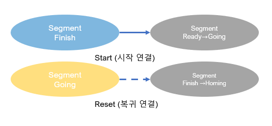
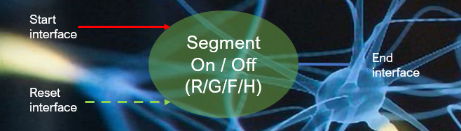
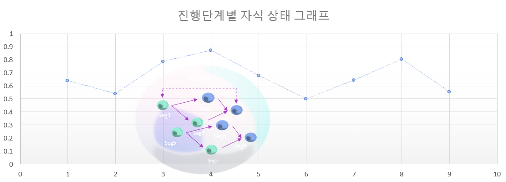

# Dualsoft language 4 rules

## 1. 인과행위(Edge) 법칙
  - Segment는 이전 행위 결과(Finish)에 의해 시작(Start)하고 다른 행위의 움직임(Going)에 초기화(Reset) 된다.
    -  A(Finish) → Start  B
    -  B(Going) → Reset  C

## 2. 상태관찰(Segment) 법칙
  - Segment(child)는 능동(Active) 행위(Parent)에 의해 행위 값(Value)를 4가지 단일 상태(Ready, Going, Homimg, Finish)로 관찰한다.
     

## 3. 고유행위(Processing) 법칙
  - Segment는 시공간을 무시한 인과 논리 처리를 기본으로 하며, 내부 자식 행위들은 복수의 초기값이 정해진 고유한 과정(Processing)을 가진다.

## 4. 우선리셋(Interface) 법칙
  - Segment는 Interface 입력이 유지되어야 동작하며, 시작(Start)과 복귀(Reset)가 동시에 입력될 때 무조건 Reset 명령을 우선한다.

