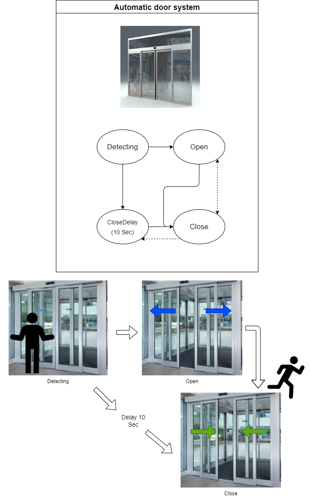

:smile: Welcome to the DS world  :smile:
# Example 3

## Automatic door system :door:


 
 
  - action list 
    1. Open
    2. Close
    3. Detecting

```
 [Sys]door  = { Open <|> Close
               Detecting > Open
               (! Detecting) > Close
  }
```
