# DS text language table
## 1. Sequence
### 1.1 Causal

<table>
<thead>
<tr>
<th>Id</th>
<th>Item</th>
<th>Unit</th>
<th>Example</th>
<th>Desc</th>
<th>GUI</th>
</tr>
</thead>

<tbody>

<tr>
<td>Seq1</td>
<td>Start Causal</td>
<td>></td>
<td>A > B > C</td>
<td>B be caused by A</td>
<td>

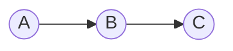
</td>
</tr>
<tr>
<td>Seq2</td>
<td>Reset Causal</td>
<td>|></td>
<td>A > B <| C</td>
<td>B is initialized to A</td>
<td>

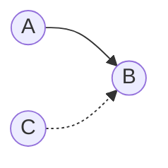
</td>
</tr>
<tr>
<td>Seq3</td>
<td>And Causal</td>
<td>,</td>
<td>A,B,C > D</td>
<td>C be caused by A& B</td>
<td>

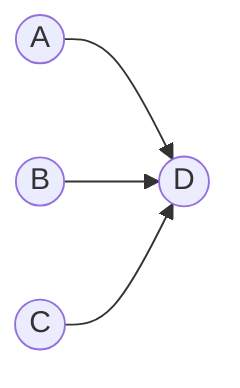
</td>
</tr>
<tr>
<td>Seq4</td>
<td>Or Causal</td>
<td>\n</td>
<td>A,B > D<br>C>D
</td>
<td>D be caused by A and B, or C</td>
<td>

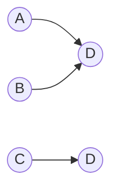
</td>
</tr>
</tbody>

</table>


</BR>

### 1.2 Call

<table>
<thead>
<tr>
<th>Id</th>
<th>Item</th>
<th>Unit</th>
<th>Example</th>
<th>Desc</th>
<th>GUI</th>
</tr>
</thead>

<tbody>

<tr>
<td>Seq5</td>
<td>Call</td>
<td>~</td>
<td>A ~ B</td>
<td>B be called by A</td>
<td>

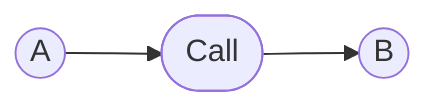

</td>
</tr>

<td>Seq6</td>
<td>And Call</td>
<td>,</td>
<td>A,B,C ~ D,E</td>
<td>D & E be called by A & B & C</td>
<td>

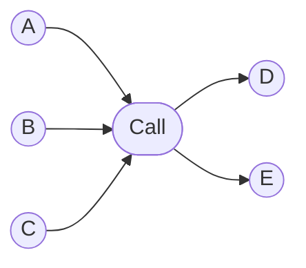

</td>
</tr>

</tbody>

</table>

### 1.3 Root

<table>
<thead>
<tr>
<th>Id</th>
<th>Item</th>
<th>Unit</th>
<th>Example</th>
<th>Desc</th>
<th>GUI</th>
</tr>
</thead>

<tbody>

<tr>
<td>Seq7</td>
<td>Root</td>
<td>[Sys]=</td>
<td>[Sys]A = {S1}</td>
<td>processing S1</td>
<td>

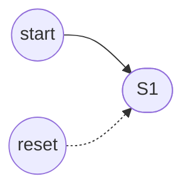

</td>
</tr>

</tbody>

</table>

## 2. Data

</BR>

### 2.1 Comparision operation

<table>
<thead>
<tr>
<th>Id</th>
<th>Item</th>
<th>Unit</th>
<th>Example</th>
<th>Desc</th>
<th>Extension</th>
<th>Extension GUI</th>
</tr>
</thead>

<tbody>

<tr>
<td>Op1</td>
<td>Equals</td>
<td>[macro]=</td>
<td>(B = 3) > A</td>
<td> A be caused by if B EQ 3.</td>
<td>(B = 3) | (C > D) > A</td>
<td>


</td>
</tr>
<tr>
<td>Op2</td>
<td>Not equals</td>
<td>[macro]!=</td>
<td>(B != 3) > A</td>
<td>A be caused by if B NE 3.</td>
<td>(B != 3) | (C > D) > A</td>
<td>

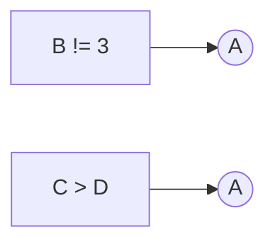

</td>
</tr><tr>
<td>Op3</td>
<td>Greater than</td>
<td>[macro]></td>
<td>(B > 3) > A</td>
<td>A be caused by if B GT 3.</td>
<td>(B > 3) | (C > D) > A</td>
<td>


</td>
</tr><tr>
<td>Op4</td>
<td>Less than</td>
<td>[macro]<</td>
<td>(B < 3) > A</td>
<td>A be caused by if B LT 3.</td>
<td>(B < 3) | (C > D) > A</td>
<td>

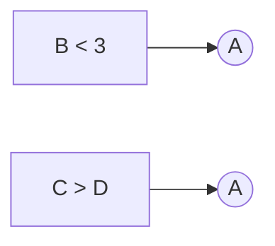
</td>
</tr><tr>
<td>Op5</td>
<td>Greater Equals than</td>
<td>[macro]>=</td>
<td>(B >= 3) > A</td>
<td>A be caused by if B GE 3.</td>
<td>(B >= 3) | (C > D) > A</td>
<td>

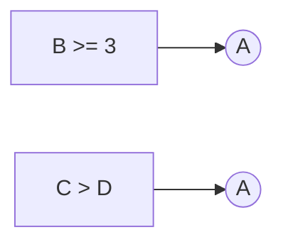

</td>
</tr><tr>
<td>Op6</td>
<td>Less Equals than</td>
<td>[macro]<=</td>
<td>(B <= 3) > A</td>
<td>A be caused by if B LE 3.</td>
<td>(B <= 3) | (C > D) > A</td>
<td>


</td>
</tr>
</tbody>

</table>


</BR>

### 2.2 Data transfer

</BR>

<table>
<thead>
<tr>
<th>Id</th>
<th>Item</th>
<th>Unit</th>
<th>Example</th>
<th>Desc</th>
<th>Extension</th>
<th>Extension GUI</th>
</tr>
</thead>

<tbody>

<tr>
<td>Op7</td>
<td>Copy</td>
<td>[macro]<- </td>
<td>(C <- B)</td>
<td>Copy B to C.</td>
<td>(C <- 0)</td>
<td>

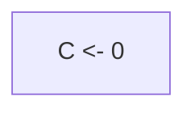

</td>
</tr>

<tr>
<td>Op8</td>
<td>Initialize</td>
<td>[macro]=</td>
<td>(A = 65)</td>
<td>Initialize A.</td>
<td>[Sys]A = 65 //초기화</td>
<td>

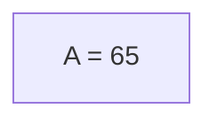

</td>
</tr>

</tbody>

</table>

</BR>

### 2.3 Arithmetic operation

|Id| Item | Unit | Example| Desc | Extension | Extension GUI | 
|:---:|:----|:--:|:---:|:----|:---|:---|
|Op9|Addition | [macro]+ | (B + 3)  | B plus 3. |(C <- (B + 3)) > A|
|Op10|Subtraction|[macro]- |(B - 3)| B minus 3. | |
|Op11|Multiplication | [macro]* | (B * 3)  | B multiplied by 3. |((A + 3) * 3)|
|Op12|Division|[macro]/ |(B / 3)| B divided by 3. | |

</BR>

### 2.4 Data conversion

|Id| Item | Unit | Example| Desc | Extension | Extension GUI | 
|:---:|:----|:--:|:---:|:----|:---|:---|
|Op13| Numeric  | [macro]NUM  | (C <- (NUM B))  | C converts B to Numeric.  | B = 65 //초기화 |
|Op14| String  | [macro]STR  | (C <- (STR B))  | C converts B to String.  | [Sys]C <- STR(B) //C에 'A' Setting |
|Op15| BCD  | [macro]BCD  | (C <- (BCD B))  | C converts B to BCD.  |
|Op16| BIN  | [macro]BIN  | (C <- (BIN B))  | C converts B to BIN.  |

</BR>


## 3. Application

</BR>

### 3.1 Logical operation

|Id| Item | Unit | Example| Desc | Extension | Extension GUI | 
|:---:|:----|:--:|:---:|:----|:---|:---|
|Op17| And | [macro]& | (A&B) > C | C be caused by A end  & B end |
|Op18| Or | [macro]\| | (A\|B) > C | C be caused by A end or B end | 
|Op19| Not | [macro]! | (!A) > B | B be caused by not end A | (!A \|> B) |
|Op20| XOR | [macro]XOR | (XOR B, C) > A | A is exclusive or (B end, C end) |
|Op21| NXOR | [macro]NXOR | (NXOR B, C) > A | A is NXOR (B end, C end) |
|Op22| NAND | [macro]NAND | (NAND B, C) > A | A is NAND (B end, C end) |
|Op23| NOR | [macro]NOR | (NOR B, C) > A | A is NOR (B end, C end) |

##### AND
(AND A B)
```mermaid
    graph LR;
        subgraph "(AND A B)"
        A("(A)")-->R((R));
        B("(B)")-->R;
        NA("(!A)") .->R3((R))
        NB("(!B)") .->R4((R))
        end
  ```

##### OR
(OR A B)
```mermaid
    graph LR;
        subgraph "(OR A B)"
        A("(A)")-->R1((R));
        B("(B)")-->R2((R));
        NA("(AND (!A) (!B))") .->R3((R))
        end
  ```

##### NOT
(NOT A)
```mermaid
    graph LR;
        subgraph "(NOT A)"
        A("(A)") .->NOT;
        ON("ON(VCC)")-->NOT((NOT));
        end
  ```

##### XOR
(XOR A B) : Ver1
```
= (OR
    (AND (A) (!B))
    (AND (!A) (B))) 
  ```    

##### NXOR
(NXOR A B)
```mermaid
    graph LR;
        subgraph "(NXOR A B)"
        id("(! (XOR A B))")
        end
  ```


##### NAND
(NAND A B)
```mermaid
    graph LR;
        subgraph "(NAND A B)"
        id("(! (AND A B))")
        end
  ```

##### NOR
(NOR A B)
```mermaid
    graph LR;
        subgraph "(NOR A B)"
        id("(! (OR A B))")
        end
  ```

</BR>


### 3.x Function Segment
- Function 를 포함하는 segment
- $f(x)$ 의 return type 이 T 일 경우 (void type 은 제외)
  segment 내에 T type 변수 (.RESULT)를 가지는 segment
- $f(x)$ 평가에 시간이 소요되는 경우, S,R,E 를 통해 인과 제어 가능  


### 3.2 Time operation

|Id| Item | Unit | Example| Desc | Extension | Extension GUI | 
|:---:|:----|:--:|:---:|:----|:---|:---|
|Op24|On Delay | [macro]#s> | A (5s)> B  | B be caused by A 5sec delay    |A (5ms)> B|
|Op25|Off Delay|[macro]#s!> |(!A) (5s)> B| B be caused by not End A 5sec delay    |(!A) (5ms)> B |

##### DELAY
<!--  -->


(TON instanceName delay S R E) // ON DELAY
```mermaid
    graph LR;
        subgraph "(TON instanceName delay S R E)"
        id("(S)") --> X(("instanceName<br>RESULT <- (DELAY delay)")) --> E((E))
        R("(R)") .-> X
        end
  ```

(TOF instanceName delay S R E)   // OFF DELAY
```mermaid
    graph LR;
        subgraph "(TOF instanceName delay S R E)"
        id("(!S)") --> X(("instanceName<br>RESULT <- (DELAY delay)")) --> E((E))
        R("(R)") .-> X
        end
  ```

</BR>

### 3.3 Value operation

|Id| Item | Unit | Example| Desc | Extension | Extension GUI | 
|:---:|:----|:--:|:---:|:----|:---|:---|
|Op26|End Value |[macro].E | (A.E)> B  | B be caused by A End Value    |A> (Start First _A) <\| (Reset A);  _A > B ||
|Op27|Start Value |[macro].S | (A.S)> B  | B be caused by A Start Value    |||
|Op28|Reset Value |[macro].R | (A.R)> B  | B be caused by A Reset Value    |||
|Op29|Going Status|[macro].G |(A.G)> B | B be caused by A Going Value     |||
|Op30|Homing Status|[macro].H |(A.H)> B | B be caused by A Homing Value     |||

##### VALUE
(VALUE A)
- PRIMITIVE : A.End

##### GOING
(GOING A)
- A.{S, R, E} 가 read access 접근 가능할 때에 한함.
1. A가 Start 우선인 경우
    (AND (A.S) (!A.E))
1. A가 Reset 우선인 경우
    (AND (!A.R) (AND (A.S) (!A.E)))
       
##### HOMING
(HOMING A)
- A.{S, R, E} 가 read access 접근 가능할 때에 한함.
1. A가 Start 우선인 경우
    (AND (!A.S) (AND (A.R) (A.E)))
1. A가 Reset 우선인 경우
    (AND (A.R) (A.E))


</BR>

### 3.4 Calculation operation

|Id| Item | Unit | Example| Desc | Extension | Extension GUI | 
|:---:|:----|:--:|:---:|:----|:---|:---|
|Op31|Abs | [macro]ABS | (ABS A)  | Calculate the absolute value of A. |
|Op32|Sin|[macro]SIN |(SIN A)| Calculate the Sin of A. | 
|Op33|Round | [macro]ROUND | (ROUND A) | Calculate the rounding of A.  | 
|Op##|...|

##### ABS
RSLT <- (ABS value)
```mermaid
    graph LR;
        subgraph "(RSLT <- (ABS value))"
        X("(RSLT <- (ABS value))")
        end
  ```

(ABS instanceName value S R E)
```mermaid
    graph LR;
        subgraph "(ABS instanceName value S R E)"
        id("(S)") --> X(("instanceName </br> RESULT <- (ABS value)")) --> E((E))
        R("(R)") .-> X
        end
  ```


## 4. Interface

### 4.1 Priority operation

<table>

<thead>
<tr>
<th>Id</th>
<th>Item</th>
<th>Unit</th>
<th>Example</th>
<th>Desc</th>
<th>Extension</th>
<th>Extension GUI</th>
</tr>
</thead>

<tbody>
<tr>
<td>If1</td>
<td>Start Priority</td>
<td>[macro]StartFirst</td>
<td>A > (StartFirst B) <|C</td>
<td>The B start value overrides the B reset value.</td>
<td>A > B
C,(!A) |> B</td>

<td>

```mermaid
    flowchart LR;A((A)) --> B((B)); C((C)) & NotA[!A] .->B((B))
```

</td>
</tr>

<tr>
<td>If2</td>
<td>Last Priority</td>
<td>[macro]LastFirst</td>
<td>A > (LastFirst B) <|C</td>
<td>During startup/reset, last occurrence takes precedence</td>
<td>C > CT <| A
A > B <| (CT)</td>
<td>

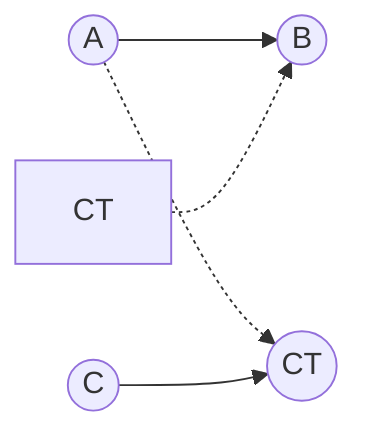

</td>
</tr>

</tbody>

</table>


### 4.2  Sustain operation

<table>

<thead>
<tr>
<th>Id</th>
<th>Item</th>
<th>Unit</th>
<th>Example</th>
<th>Desc</th>
<th>Extension</th>
<th>Extension GUI</th>
</tr>
</thead>

<tbody>
<tr>
<td>If3</td>
<td>Start Sustain</td>
<td>[macro]SusS</td>
<td>A > (SusS B)</td>
<td>Sustain until B is Homing</td>
<td>A > (SusS B) <| C</td>

<td>

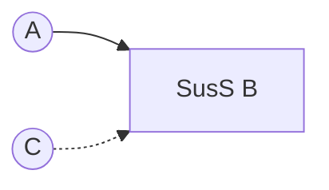

</td>
</tr>

<tr>
<td>If4</td>
<td>Reset Sustain</td>
<td>[macro]SusR</td>
<td>A > (SusR B)</td>
<td>Sustain until B is Going</td>
<td>A > (SusR B) <| C</td>
<td>

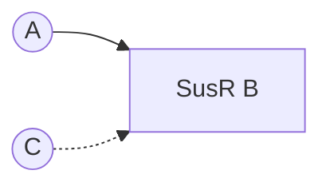

</td>
</tr>

<tr>
<td>If5</td>
<td>SR Sustain</td>
<td>[macro]SusSR</td>
<td> A > (SusSR B)</td>
<td>Start/Reset Sustain</td>
<td>A > (SusSR B) <| C</td>
<td>

```mermaid
    flowchart LR; A((A)) --> M1[SusSR B];C((C)) .-> M1[SusSR B]
```

</td>
</tr>
</tbody>

</table>


### 4.3 Single  operation

<table>

<thead>
<tr>
<th>Id</th>
<th>Item</th>
<th>Unit</th>
<th>Example</th>
<th>Desc</th>
<th>Extension</th>
<th>Extension GUI</th>
</tr>
</thead>

<tbody>
<tr>
<td>If6</td>
<td>Start Single</td>
<td>[macro]OnlyS</td>
<td>A > (OnlyS B)</td>
<td>The B reset value is B Start not</td>
<td> A > B <| (!A)</td>

<td>

```mermaid
    flowchart LR;A((A)) --> B((B));NotA[!A] .-> B((B));
```

</td>
</tr>

<tr>
<td>If7</td>
<td>Reset Single</td>
<td>[macro]OnlyR</td>
<td>A > (OnlyR B)</td>
<td>The B start value is B reset not</td>
<td>A |> B < (!A)</td>
<td>

```mermaid
    flowchart LR;A((A)) .-> B((B));NotA[!A] --> B((B));
```

</td>
</tr>

<tr>
<td>If8</td>
<td>Self Reset</td>
<td>[macro]SelfR</td>
<td>A > (SelfR B)</td>
<td>The B reset value is B end Value</td>
<td>A > (SusR B) <| (B.E)</td>
<td>

```mermaid
    flowchart LR;A((A)) --> susRB[SusR B];B.E[B.E] .-> susRB[SusR B];
```

</td>
</tr>
</tbody>

</table>

 
## 5. System

### 5.1  Constain

<table>
<thead>
<tr>
<th>Id</th>
<th>Item</th>
<th>Unit</th>
<th>Example</th>
<th>Desc</th>
<th>Extension</th>
<th>Extension GUI</th>
</tr>
</thead>

<tbody>
<tr>
<td>Sys1</td>
<td>Numeric</td>
<td>[macro]#</td>
<td>(#3 + B) > A</td>
<td>A be caused by B add 56</td>
<td>#3 = ~ Numeric.Bit0, Numeric.Bit1</td>

<td>

```mermaid
    graph LR;
    Hash3((#3)) --> call([Call]) --> Bit0[Numeric.Bit0] & Bit1[Numeric.Bit1]
```

</td>
</tr>

<tr>
<td>Sys2</td>
<td>String</td>
<td>[macro]$</td>
<td>($A = B) > A</td>
<td>A be caused by B Equal to 'A'</td>
<td>$A = ~ String.Bit0, String.Bit6</td>
<td>

```mermaid
    flowchart LR;
    A((&A)) --> call([Call]) --> Bit0[Numeric.Bit0] & Bit6[Numeric.Bit6]
```

</td>
</tr>

</tbody>

</table>

### 5.2  System Bit

<table>
<thead>
<tr>
<th>Id</th>
<th>Item</th>
<th>Unit</th>
<th>Example</th>
<th>Desc</th>
<th>Extension</th>
<th>Extension GUI</th>
</tr>
</thead>

<tbody>

<tr>
<td>Sys3</td>
<td>Always On</td>
<td>[macro]_On</td>
<td>(_On) > A</td>
<td>A be caused by Always On</td>
<td>Numeric.Bit0 > On</td>
<td>

```mermaid
    flowchart LR;S1[Numeric.Bit0] --> S2((On))
```

</td>
</tr>

<tr>
<td>Sys4</td>
<td>Always Off</td>
<td>[macro]_Off</td>
<td>(_Off) > A</td>
<td>A be caused by Always Off</td>
<td>(! Numeric.Bit0) > Off</td>
<td>

```mermaid
    flowchart LR;S1[! Numeric.Bit0] --> S2((Off))
```
</td>
</tr>

<tr>
<td>Sys5</td>
<td>Running Flag</td>
<td>[macro]_Run</td>
<td>(_Run) > A</td>
<td>A be caused by System Run</td>
<td>(SystemRoot.S) > (OnlyS Run)</td>
<td>

```mermaid
flowchart LR;S1[SystemRoot.S] --> S2[OnlyS Run]
```
</td>
</tr>

<tr>
<td>Sys6</td>
<td>Stop Flag</td>
<td>[macro]_Run</td>
<td>(_Stop) > A</td>
<td>A be caused by System Stop</td>
<td>(SystemRoot.R) > (OnlyS Stop)</td>
<td>

```mermaid
flowchart LR;S1[SystemRoot.R] --> S2[OnlyS Stop]
```

</td>
</tr>

<tr>
<td>Sys7</td>
<td>Running Rising</td>
<td>[macro]_RunRising</td>
<td>(_RunRising) > A</td>
<td>A be caused by System Run Rising</td>
<td>(SystemRoot.S) > (OnlyS Run)</td>
<td>

```mermaid
flowchart LR;S1[SystemRoot.S.G] --> S2[OnlyS RunRising]
```
</td>
</tr>

</tbody>

</table>

### 5.3 System timer

<table>
<thead>
<tr>
<th>Id</th>
<th>Item</th>
<th>Unit</th>
<th>Example</th>
<th>Desc</th>
<th>Extension</th>
<th>Extension GUI</th>
</tr>
</thead>

<tbody>
<tr>
<td>Sys8</td>
<td>toggle #s </td>
<td> [macro]_T </td>
<td> (_T 50ms) > A  </td>
<td>On/Off occurs at periodic intervals of 50msec. </td>
<td> T1 <|> T2; T1 (50ms)> T2 ; T2 (50ms)> T1; (T2.E) > A </td>
<td>

```mermaid
    graph LR;
        T1((T1)) .-> T2((T2)) .-> T1((T1));
        T1((T1)) -- 50ms --> T2((T2)) -- 50ms--> T1((T1));
        T2.E-->A((A))
```

</td>
</tr>
</tbody>

</table>


<!--

<table>
<thead>
<tr>
<th>Id</th>
<th>Item</th>
<th>Unit</th>
<th>Example</th>
<th>Desc</th>
<th>GUI</th>
</tr>
</thead>

<tbody>

<tr>
<td></td>
<td></td>
<td></td>
<td></td>
<td></td>
<td>

```mermaid
    
```

</td>
</tr>

</tbody>

</table>


<table>
<thead>
<tr>
<th>Id</th>
<th>Item</th>
<th>Unit</th>
<th>Example</th>
<th>Desc</th>
<th>Extension</th>
<th>Extension GUI</th>
</tr>
</thead>

<tbody>

<tr>
<td></td>
<td></td>
<td></td>
<td></td>
<td></td>
<td></td>
<td>

```mermaid
    
```

</td>
</tr>

</tbody>

</table>

-->