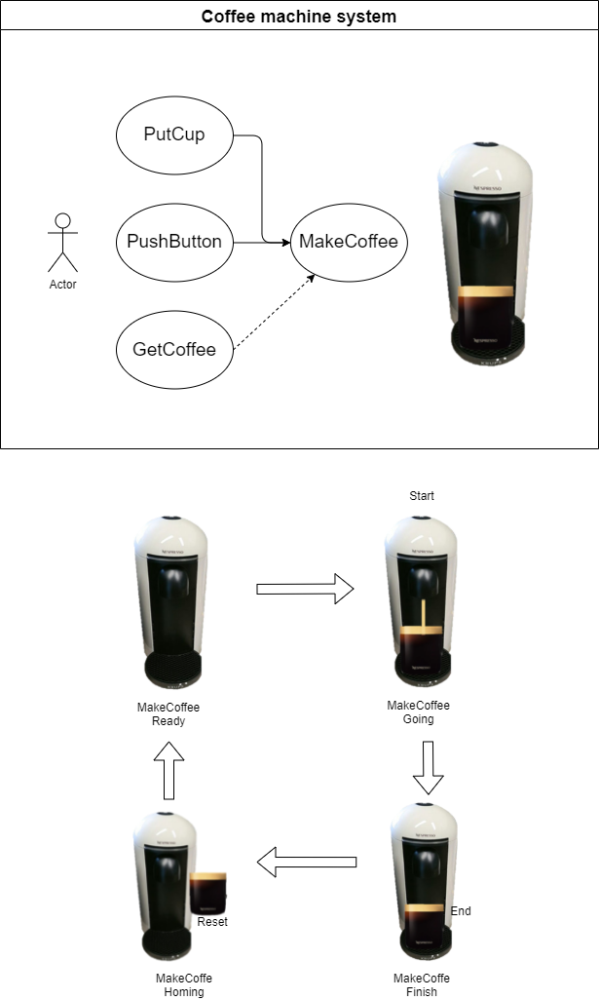

# DS text language table
## 1. Sequence
### 1.1 Causal
|Id| Item | Unit |Example|   Desc |  GUI | 
|:---:|:----|:--:|:---:|:----|:---|
|Seq1|Start Causal|>| A > B > C |B be caused by A | <code class="mermaid">flowchart LR;A((A)) --> B((B)) --> C((C));</code>
|Seq2|Reset Causal| \|> | A > B <\| C|B is initialized to A | <div class="mermaid">flowchart LR;A((A)) --> B((B)); C((C)) .-> B((B));</div>
|Seq3|And Causal|,|A,B,C > D | C be caused by A & B | <div class="mermaid">flowchart LR;A((A)) & B((B)) & C((C)) --> D((D));</div>
|Seq4|Or Causal|\\n| A,B>D<p>C>D | D be caused by A and B, or C | <div class="mermaid">flowchart LR;A((A)) & B((B)) --> D((D)); C((C)) --> D2((D))</div>

</BR>

### 1.2 Call

|Id| Item | Unit | Example | Desc |   GUI | 
|:---:|:----|:--:|:----|:---|:---|
|Seq5|Call | ~ |A ~ B |  B be called by A |<div class="mermaid">flowchart LR;A((A)) --> call([Call]) --> B((B));</div>
|Seq6|And Call|,| A,B,C ~ D,E|D & E be Called by A & B & C |<div class="mermaid">flowchart LR;A((A)) & B((B)) & C((C)) --> call([Call]) --> D((D)) & E((E))</div>

</BR>

### 1.3 Root

|Id| Item | Unit | Example | Desc |   GUI | 
|:---:|:----|:--:|:----|:---|:---|
|Seq7|Root | [Sys]= |  [Sys]A = {S1}| processing S1  |<div class="mermaid">flowchart LR;A((start)) --> Root([Root]);  B((reset)) .-> Root([S1]);</div>

</BR>

## 2. Data

</BR>

### 2.1 Comparision operation

|Id| Item | Unit | Example| Desc | Extension | Extension GUI | 
|:---:|:----|:--:|:---:|:----|:---|:---|
|Op1|Equals|[func]=|(B = 3) > A| A be caused by if B EQ 3. | (B = 3) \| (C > D) > A| <div class="mermaid">flowchart LR;M1[B = 3] --> A((A));M2[C > D] --> A2((A))</div>
|Op2|Not equals |[func]!=|(B != 3) > A| A be caused by if B NE 3. |(B != 3) \| (C > D) > A| <div class="mermaid">flowchart LR;M1[B != 3] --> A((A));M2[C > D] --> A2((A))</div>
|Op3|Greater than |[func]>|(B > 3) > A| A be caused by if B GT 3. |(B > 3) \| (C > D) > A| <div class="mermaid">flowchart LR;M1[B > 3] --> A((A));M2[C > D] --> A2((A))</div>
|Op4|Less than|[func]<|(B < 3) > A| A be caused by if B LT 3. |(B < 3) \| (C > D) > A| <div class="mermaid">flowchart LR;M1[B < 3] --> A((A));M2[C > D] --> A2((A))</div>
|Op5|Greater Equals than |[func]>=|(B >= 3) > A| A be caused by if B GE 3. |(B >= 3) \| (C > D) > A| <div class="mermaid">flowchart LR;M1[B >= 3] --> A((A));M2[C > D] --> A2((A))</div>
|Op6|Less Equals than|[func]<=|(B <= 3) > A| A be caused by if B LE 3. |(B <= 3) \| (C > D) > A| <div class="mermaid">flowchart LR;M1[B <= 3] --> A((A));M2[C > D] --> A2((A))</div>


</BR>

### 2.2 Data transfer

</BR>

|Id| Item | Unit | Example| Desc | Extension | Extension GUI | 
|:---:|:----|:--:|:---:|:----|:---|:---|
|Op7|Copy | [func]<- | (C <- B)  | Copy B to C. |(C <- 0)| <div class="mermaid">flowchart LR;M[C <- 0]</div>
|Op8|Initialize|[func]= |(A = 65)| Initialize A. |[Sys]A = 65 //초기화 |<div class="mermaid">flowchart LR;Sys[A = 65]</div>

</BR>

### 2.3 Arithmetic operation

|Id| Item | Unit | Example| Desc | Extension | Extension GUI | 
|:---:|:----|:--:|:---:|:----|:---|:---|
|Op9|Addition | [func]+ | (B + 3)  | B plus 3. |(C <- (B + 3)) > A|
|Op10|Subtraction|[func]- |(B - 3)| B minus 3. | |
|Op11|Multiplication | [func]* | (B * 3)  | B multiplied by 3. |((A + 3) * 3)|
|Op12|Division|[func]/ |(B / 3)| B divided by 3. | |

</BR>

### 2.4 Data conversion

|Id| Item | Unit | Example| Desc | Extension | Extension GUI | 
|:---:|:----|:--:|:---:|:----|:---|:---|
|Op13| Numeric  | [func]NUM  | (C <- (NUM B))  | C converts B to Numeric.  | B = 65 //초기화 |
|Op14| String  | [func]STR  | (C <- (STR B))  | C converts B to String.  | [Sys]C <- STR(B) //C에 'A' Setting |
|Op15| BCD  | [func]BCD  | (C <- (BCD B))  | C converts B to BCD.  |
|Op16| BIN  | [func]BIN  | (C <- (BIN B))  | C converts B to BIN.  |

</BR>


## 3. Application

</BR>

### 3.1 Logical operation

|Id| Item | Unit | Example| Desc | Extension | Extension GUI | 
|:---:|:----|:--:|:---:|:----|:---|:---|
|Op17| And | [func]& | (A&B) > C | C be caused by A end  & B end |
|Op18| Or | [func]\| | (A\|B) > C | C be caused by A end or B end | 
|Op19| Not | [func]! | (!A) > B | B be caused by not end A | (!A \|> B) |
|Op20| XOR | [func]XOR | (XOR B, C) > A | A is exclusive or (B end, C end) |
|Op21| NXOR | [func]NXOR | (NXOR B, C) > A | A is NXOR (B end, C end) |
|Op22| NAND | [func]NAND | (NAND B, C) > A | A is NAND (B end, C end) |
|Op23| NOR | [func]NOR | (NOR B, C) > A | A is NOR (B end, C end) |

##### AND
(AND A B)
```mermaid
    graph LR;
        subgraph "(AND A B)"
        A("(A)")-->R((R));
        B("(B)")-->R;
        NA("(!A)") .->R3((R))
        NB("(!B)") .->R4((R))
        end
  ```

##### OR
(OR A B)
```mermaid
    graph LR;
        subgraph "(OR A B)"
        A("(A)")-->R1((R));
        B("(B)")-->R2((R));
        NA("(AND (!A) (!B))") .->R3((R))
        end
  ```

##### NOT
(NOT A)
```mermaid
    graph LR;
        subgraph "(NOT A)"
        A("(A)") .->NOT;
        ON("ON(VCC)")-->NOT((NOT));
        end
  ```

##### XOR
(XOR A B) : Ver1
```
= (OR
    (AND (A) (!B))
    (AND (!A) (B))) 
  ```    

##### NXOR
(NXOR A B)
```mermaid
    graph LR;
        subgraph "(NXOR A B)"
        id("(! (XOR A B))")
        end
  ```


##### NAND
(NAND A B)
```mermaid
    graph LR;
        subgraph "(NAND A B)"
        id("(! (AND A B))")
        end
  ```

##### NOR
(NOR A B)
```mermaid
    graph LR;
        subgraph "(NOR A B)"
        id("(! (OR A B))")
        end
  ```

</BR>


### 3.x Function Segment
- Function 를 포함하는 segment
- $f(x)$ 의 return type 이 T 일 경우 (void type 은 제외)
  segment 내에 T type 변수 (.RESULT)를 가지는 segment
- $f(x)$ 평가에 시간이 소요되는 경우, S,R,E 를 통해 인과 제어 가능  


### 3.2 Time operation

|Id| Item | Unit | Example| Desc | Extension | Extension GUI | 
|:---:|:----|:--:|:---:|:----|:---|:---|
|Op24|On Delay | [func]#s> | A (5s)> B  | B be caused by A 5sec delay    |A (5ms)> B|
|Op25|Off Delay|[func]#s!> |(!A) (5s)> B| B be caused by not End A 5sec delay    |(!A) (5ms)> B |

##### DELAY
<!--  -->


(TON instanceName delay S R E) // ON DELAY
```mermaid
    graph LR;
        subgraph "(TON instanceName delay S R E)"
        id("(S)") --> X(("instanceName<br>RESULT <- (DELAY delay)")) --> E((E))
        R("(R)") .-> X
        end
  ```

(TOF instanceName delay S R E)   // OFF DELAY
```mermaid
    graph LR;
        subgraph "(TOF instanceName delay S R E)"
        id("(!S)") --> X(("instanceName<br>RESULT <- (DELAY delay)")) --> E((E))
        R("(R)") .-> X
        end
  ```

</BR>

### 3.3 Value operation

|Id| Item | Unit | Example| Desc | Extension | Extension GUI | 
|:---:|:----|:--:|:---:|:----|:---|:---|
|Op26|End Value |[func].E | (A.E)> B  | B be caused by A End Value    |A> (Start First _A) <\| (Reset A);  _A > B ||
|Op27|Start Value |[func].S | (A.S)> B  | B be caused by A Start Value    |||
|Op28|Reset Value |[func].R | (A.R)> B  | B be caused by A Reset Value    |||
|Op29|Going Status|[func].G |(A.G)> B | B be caused by A Going Value     |||
|Op30|Homing Status|[func].H |(A.H)> B | B be caused by A Homing Value     |||

##### VALUE
(VALUE A)
- PRIMITIVE : A.End

##### GOING
(GOING A)
- A.{S, R, E} 가 read access 접근 가능할 때에 한함.
1. A가 Start 우선인 경우
    (AND (A.S) (!A.E))
1. A가 Reset 우선인 경우
    (AND (!A.R) (AND (A.S) (!A.E)))
       
##### HOMING
(HOMING A)
- A.{S, R, E} 가 read access 접근 가능할 때에 한함.
1. A가 Start 우선인 경우
    (AND (!A.S) (AND (A.R) (A.E)))
1. A가 Reset 우선인 경우
    (AND (A.R) (A.E))


</BR>

### 3.4 Calculation operation

|Id| Item | Unit | Example| Desc | Extension | Extension GUI | 
|:---:|:----|:--:|:---:|:----|:---|:---|
|Op31|Abs | [func]ABS | (ABS A)  | Calculate the absolute value of A. |
|Op32|Sin|[func]SIN |(SIN A)| Calculate the Sin of A. | 
|Op33|Round | [func]ROUND | (ROUND A) | Calculate the rounding of A.  | 
|Op##|...|

##### ABS
RSLT <- (ABS value)
```mermaid
    graph LR;
        subgraph "(RSLT <- (ABS value))"
        X("(RSLT <- (ABS value))")
        end
  ```

(ABS instanceName value S R E)
```mermaid
    graph LR;
        subgraph "(ABS instanceName value S R E)"
        id("(S)") --> X(("instanceName </br> RESULT <- (ABS value)")) --> E((E))
        R("(R)") .-> X
        end
  ```


## 4. Interface

### 4.1 Priority operation

|Id| Item | Unit | Example| Desc | Extension | Extension GUI | 
|:---:|:----|:--:|:---:|:----|:---|:---|
|If1|Start Priority | [macro]StartFirst | A > (StartFirst B) <\|C  | The B start value overrides the B reset value. | A > B <p> C,(!A) \|> B |<div class="mermaid">flowchart LR;A((A)) --> B((B)); C((C)) & NotA[!A] .->B((B))</div>
|If2|Last Priority  | [macro]LastFirst  | A >  (LastFirst B) <\|C | During startup/reset, last occurrence takes precedence | C > CT <\| A  <p> A > B <\| (CT) | <div class="mermaid">flowchart LR;A((A)) --> B((B)); A((A)) .-> CT((CT)); C((C)) --> CT((CT)); CT2[CT] .->B((B))</div>
|If2|Last Priority  | [macro]LastFirst  | A >  (LastFirst B) <\|C | During startup/reset, last occurrence takes precedence | C > CT <\| A  <p> A > B <\| (CT) | 


### 4.2  Sustain operation

|Id| Item | Unit | Example| Desc | Extension | Extension GUI | 
|:---:|:----|:--:|:---:|:----|:---|:---|
|If3|Start Sustain | [macro]SusS | A > (SusS B)  | Sustain until B is Homing | A > (SusS B) <\| C | <div class="mermaid">flowchart LR; A((A)) --> M1[SusS B];C((C)) .-> M1[SusS B]</div>
|If4|Reset Sustain |[macro]SusR |A > (SusR B)| Sustain until B is Going | A > (SusR B) <\| C | <div class="mermaid">flowchart LR; A((A)) --> M1[SusR B];C((C)) .-> M1[SusR B]</div> 
|If5|SR Sustain | [macro]SusSR | A > (SusSR B) | Start/Reset Sustain  | A > (SusSR B) <\| C | <div class="mermaid">flowchart LR; A((A)) --> M1[SusSR B];C((C)) .-> M1[SusSR B]</div>


### 4.3 Single  operation

|Id| Item | Unit | Example| Desc | Extension | Extension GUI | 
|:---:|:----|:--:|:---:|:----|:---|:---|
|If6|Start Single  | [macro]OnlyS | A > (OnlyS B) | The B reset value is B Start not | A > B <\| (!A) | <div class="mermaid">flowchart LR;A((A)) --> B((B));NotA[!A] .-> B((B));</div> 
|If7|Reset Single  | [macro]OnlyR | A > (OnlyR B) | The B start value is B reset not | A \|> B < (!A) | <div class="mermaid">flowchart LR;A((A)) .-> B((B));NotA[!A] --> B((B));</div> 
|If8|Self Reset  | [macro]SelfR | A > (SelfR B) | The B reset value is B end Value | A > (SusR B) <\| (B.E) |<div class="mermaid">flowchart LR;A((A)) --> susRB[SusR B];B.E[B.E] .-> susRB[SusR B];</div> 

<!--
|If8|Parent Clear  | [macro]ParentR | A > (ParentR B) | The B reset value is B parent Homing Value |  B <\| B.Parent.H | |
|If9|Parent Reset  | [macro]ParentR | A > (ParentR B) | The B reset value is B end Relay Value |  B <\| B.ER | |
-->

## 5. System

### 5.1  Constain

|Id| Item | Unit | Example| Desc | Extension | Extension GUI | 
|:---:|:----|:--:|:---:|:----|:---|:---|
|Sys1|Numeric | [macro]# | (#3 + B) > A  | A be caused by B add 56 | #3 = ~ Numeric.Bit0, Numeric.Bit1 |<div class="mermaid">flowchart LR;Hash3((#3)) --> call([Call]) --> Bit0[Numeric.Bit0] & Bit1[Numeric.Bit1]</div>
|Sys2|String |[macro]$ | ($A = B) > A| A be caused by B Equal to 'A' | $A = ~ String.Bit0, String.Bit6 |<div class="mermaid">flowchart LR;A((&A)) --> call([Call]) --> Bit0[String.Bit0] & Bit6[String.Bit6]</div>


### 5.2  System Bit

|Id| Item | Unit | Example| Desc | Extension | Extension GUI | 
|:---:|:----|:--:|:---:|:----|:---|:---|
|Sys3|Always On | [macro]_On | (_On) > A  | A be caused by Always On | Numeric.Bit0 > On |<div class="mermaid">flowchart LR;S1[Numeric.Bit0] --> S2((On))</div>
|Sys4|Always Off |[macro]_Off | (_Off) > A| A be caused by Always Off | (! Numeric.Bit0) > Off |<div class="mermaid">flowchart LR;S1[! Numeric.Bit0] --> S2((Off))</div>
|Sys5|Running Flag |[macro]_Run | (_Run) > A| A be caused by System Run | (SystemRoot.S) > (OnlyS Run) |<div class="mermaid">flowchart LR;S1[SystemRoot.S] --> S2[OnlyS Run]</div>
|Sys6|Stop Flag |[macro]_Run | (_Stop) > A| A be caused by System Stop | (SystemRoot.R) > (OnlyS Stop) | <div class="mermaid">flowchart LR;S1[SystemRoot.R] --> S2[OnlyS Stop]</div>
|Sys7|Running Rising |[macro]_RisingRun | (_RisingRun) > A | A be caused by System Run Rising | (SystemRoot.S) > (OnlyS Run) | <div class="mermaid">flowchart LR;S1[SystemRoot.S.G] --> S2[OnlyS RunRising]</div>


### 5.3  System timer

|Id| Item | Unit | Example| Desc | Extension | Extension GUI | 
|:---:|:----|:--:|:---:|:----|:---|:---|
|Sys8|toggle #s | [macro]_T | (_T 50ms) > A  | On/Off occurs at periodic intervals of 50msec. | T1 <\|> T2; T1 (50ms)> T2 ; T2 (50ms)> T1; (T2.E) > A | <div class="mermaid">flowchart LR;T1((T1)) .-> T2((T2)) .-> T1((T1));T1((T1)) -- 50ms --> T2((T2)) -- 50ms--> T1((T1));T2.E-->A((A))</div> 
