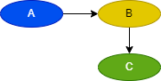
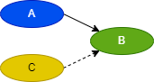
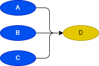
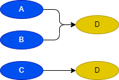
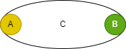
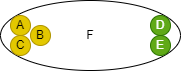
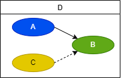
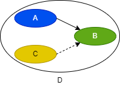

# DS text language table
## 1. Sequence
### 1.1 Causal
|Id| Item | Unit |Example|   Desc |  GUI | 
|:---:|:----|:--:|:---:|:----|:---|
|Seq1|Start Causal|>| `A > B > C` |B be caused by A | 
|Seq2|Reset Causal| \|> | `A > B <| C`|B is initialized to A | 
|Seq3|And Causal|,|`A,B,C > D` | C be caused by A & B |  
|Seq4|Or Causal|\\n| `A,B>D`
`C>D` | D be caused by A and B, or C | 

 

### 1.2 Call

|Id| Item | Unit | Example | Desc |   GUI | 
|:---:|:----|:--:|:----|:---|:---|
|Seq5|Call | ~ |`C = A ~ B` |  B be called by A | 
|Seq6|And Call|,| `C = A,B,C ~ D,E`|D & E be Called by A & B & C | 

 

### 1.3 Parent

|Id| Item | Unit | Example | Desc |   GUI | 
|:---:|:----|:--:|:----|:---|:---|
|Seq7|System Parent | [Sys]= |  `[Sys]C = A > B <| C`| causal process C  | 
|Seq8|Segement Parent| = |  `C = A > B <| C`| causal step C  | 

 

## 2. Data

 

### 2.1 Comparision operation

|Id| Item | Unit | Example| Desc |  GUI |
|:---:|:----|:--:|:---:|:----|:---|:---|
|Op1|Equals|[func]=|(B = 3) > A| A be caused by if B EQ 3. | (B = 3) \| (C > D) > A| 
|Op2|Not equals |[func]!=|(B != 3) > A| A be caused by if B NE 3. |(B != 3) \| (C > D) > A|
|Op3|Greater than |[func]>|(B > 3) > A| A be caused by if B GT 3. |(B > 3) \| (C > D) > A| 
|Op4|Less than|[func]<|(B < 3) > A| A be caused by if B LT 3. |(B < 3) \| (C > D) > A| 
|Op5|Greater Equals than |[func]>=|(B >= 3) > A| A be caused by if B GE 3. |(B >= 3) \| (C > D) > A|
|Op6|Less Equals than|[func]<=|(B <= 3) > A| A be caused by if B LE 3. |(B <= 3) \| (C > D) > A|

 

### 2.2 Data transfer

 

|Id| Item | Unit | Example| Desc |  GUI |
|:---:|:----|:--:|:---:|:----|:---|:---|
|Op7|Copy | [func]<- | (C <- B)  | Copy B to C. |(C <- 0)|
|Op8|Initialize|[func]= |(A = 65)| Initialize A. |[Sys]A = 65 //초기화 |

 

### 2.3 Arithmetic operation

|Id| Item | Unit | Example| Desc |  GUI |
|:---:|:----|:--:|:---:|:----|:---|:---|
|Op9|Addition | [func]+ | (B + 3)  | B plus 3. |(C <- (B + 3)) > A|
|Op10|Subtraction|[func]- |(B - 3)| B minus 3. | |
|Op11|Multiplication | [func]* | (B * 3)  | B multiplied by 3. |((A + 3) * 3)|
|Op12|Division|[func]/ |(B / 3)| B divided by 3. | |

 

### 2.4 Data conversion

|Id| Item | Unit | Example| Desc |  GUI |
|:---:|:----|:--:|:---:|:----|:---|:---|
|Op13| Numeric  | [func]NUM  | (C <- (NUM B))  | C converts B to Numeric.  | B = 65 //초기화 |
|Op14| String  | [func]STR  | (C <- (STR B))  | C converts B to String.  | [Sys]C <- STR(B) //C에 'A' Setting |
|Op15| BCD  | [func]BCD  | (C <- (BCD B))  | C converts B to BCD.  |
|Op16| BIN  | [func]BIN  | (C <- (BIN B))  | C converts B to BIN.  |

 

## 3. Application

 

### 3.1 Logical operation

|Id| Item | Unit | Example| Desc |  GUI |
|:---:|:----|:--:|:---:|:----|:---|:---|
|Op17| And | [func]& | (A&B) > C | C be caused by A end  & B end |
|Op18| Or | [func]\| | (A\|B) > C | C be caused by A end or B end | 
|Op19| Not | [func]! | (!A) > B | B be caused by not end A | (!A \|> B) |
|Op20| XOR | [func]XOR | (XOR B, C) > A | A is exclusive or (B end, C end) |
|Op21| NXOR | [func]NXOR | (NXOR B, C) > A | A is NXOR (B end, C end) |
|Op22| NAND | [func]NAND | (NAND B, C) > A | A is NAND (B end, C end) |
|Op23| NOR | [func]NOR | (NOR B, C) > A | A is NOR (B end, C end) |

### 3.x Function Segment
- Function 를 포함하는 segment
- $f(x)$ 의 return type 이 T 일 경우 (void type 은 제외)
  segment 내에 T type 변수 (.RESULT)를 가지는 segment
- $f(x)$ 평가에 시간이 소요되는 경우, S,R,E 를 통해 인과 제어 가능  

### 3.2 Time operation

|Id| Item | Unit | Example| Desc |  GUI |
|:---:|:----|:--:|:---:|:----|:---|:---|
|Op24|On Delay | [func]#s> | A (5s)> B  | B be caused by A 5sec delay    |A (5ms)> B|
|Op25|Off Delay|[func]#s!> |(!A) (5s)> B| B be caused by not End A 5sec delay    |(!A) (5ms)> B |

 

### 3.3 Value operation

|Id| Item | Unit | Example| Desc |  GUI |
|:---:|:----|:--:|:---:|:----|:---|:---|
|Op26|End Value |[func]Seg.E | (A.E)> B  | B be caused by A End Value    |
|Op27|Start Value |[func]Seg.S | (A.S)> B  | B be caused by A Start Value    ||
|Op28|Reset Value |[func]Seg.R | (A.R)> B  | B be caused by A Reset Value    ||
|Op29|Going Status|[func]Seg.G |(A.G)> B | B be caused by A Going Value     ||
|Op30|Homing Status|[func]Seg.H |(A.H)> B | B be caused by A Homing Value     ||

 

### 3.4 Calculation operation

|Id| Item | Unit | Example| Desc |  GUI |
|:---:|:----|:--:|:---:|:----|:---|:---|
|Op31|Abs | [func]ABS | (ABS A)  | Calculate the absolute value of A. |
|Op32|Sin|[func]SIN |(SIN A)| Calculate the Sin of A. | 
|Op33|Round | [func]ROUND | (ROUND A) | Calculate the rounding of A.  | 
|Op##|...|

## 4. Interface

### 4.1 Priority operation

|Id| Item | Unit | Example| Desc | GUI |
|:---:|:----|:--:|:---:|:----|:---|:---|
|If1|Start Priority | [macro]StartFirst | A > (StartFirst B) <\|C  | The B start value overrides the B reset value. | A > B 
 C,(!A) \|> B |
flowchart LR;A((A)) --> B((B)); C((C)) & NotA[!A] .->B((B))

|If2|Last Priority  | [macro]LastFirst  | A >  (LastFirst B) <\|C | During startup/reset, last occurrence takes precedence | C > CT <\| A  
 A > B <\| (CT) | 
flowchart LR;A((A)) --> B((B)); A((A)) .-> CT((CT)); C((C)) --> CT((CT)); CT2[CT] .->B((B))

|If2|Last Priority  | [macro]LastFirst  | A >  (LastFirst B) <\|C | During startup/reset, last occurrence takes precedence | C > CT <\| A  
 A > B <\| (CT) | 

### 4.2  Sustain operation

|Id| Item | Unit | Example| Desc | GUI |
|:---:|:----|:--:|:---:|:----|:---|:---|
|If3|Start Sustain | [macro]SusS | A > (SusS B)  | Sustain until B is Homing | A > (SusS B) <\| C | 
flowchart LR; A((A)) --> M1[SusS B];C((C)) .-> M1[SusS B]

|If4|Reset Sustain |[macro]SusR |A > (SusR B)| Sustain until B is Going | A > (SusR B) <\| C | 
flowchart LR; A((A)) --> M1[SusR B];C((C)) .-> M1[SusR B]
 
|If5|SR Sustain | [macro]SusSR | A > (SusSR B) | Start/Reset Sustain  | A > (SusSR B) <\| C | 
flowchart LR; A((A)) --> M1[SusSR B];C((C)) .-> M1[SusSR B]

### 4.3 Single  operation

|Id| Item | Unit | Example| Desc |  GUI |
|:---:|:----|:--:|:---:|:----|:---|:---|
|If6|Start Single  | [macro]OnlyS | A > (OnlyS B) | The B reset value is B Start not | A > B <\| (!A) | 
|If7|Reset Single  | [macro]OnlyR | A > (OnlyR B) | The B start value is B reset not | A \|> B < (!A) | 
|If8|Self Reset  | [macro]SelfR | A > (SelfR B) | The B reset value is B end Value | A > (SusR B) <\| (B.E) |

## 5. System

### 5.1  Constain

|Id| Item | Unit | Example| Desc |  GUI |
|:---:|:----|:--:|:---:|:----|:---|:---|
|Sys1|Numeric | [macro]# | (#3 + B) > A  | A be caused by B add 56 | #3 = ~ Numeric.Bit0, Numeric.Bit1 |
|Sys2|String |[macro]$ | ($A = B) > A| A be caused by B Equal to 'A' | $A = ~ String.Bit0, String.Bit6 |

### 5.2  System Bit

|Id| Item | Unit | Example| Desc |  GUI |
|:---:|:----|:--:|:---:|:----|:---|:---|
|Sys3|Always On | [macro]_On | (_On) > A  | A be caused by Always On | Numeric.Bit0 > On |
|Sys4|Always Off |[macro]_Off | (_Off) > A| A be caused by Always Off | (! Numeric.Bit0) > Off |
|Sys5|Running Flag |[macro]_Run | (_Run) > A| A be caused by System Run | (SystemRoot.S) > (OnlyS Run) |
|Sys6|Stop Flag |[macro]_Run | (_Stop) > A| A be caused by System Stop | (SystemRoot.R) > (OnlyS Stop) | 
|Sys7|Running Rising |[macro]_RisingRun | (_RisingRun) > A | A be caused by System Run Rising | (SystemRoot.S) > (OnlyS Run) | 

### 5.3  System timer

|Id| Item | Unit | Example| Desc | GUI |
|:---:|:----|:--:|:---:|:----|:---|:---|
|Sys8|toggle #s | [macro]_T | (_T 50ms) > A  | On/Off occurs at periodic intervals of 50msec. | T1 <\|> T2; T1 (50ms)> T2 ; T2 (50ms)> T1; (T2.E) > A |