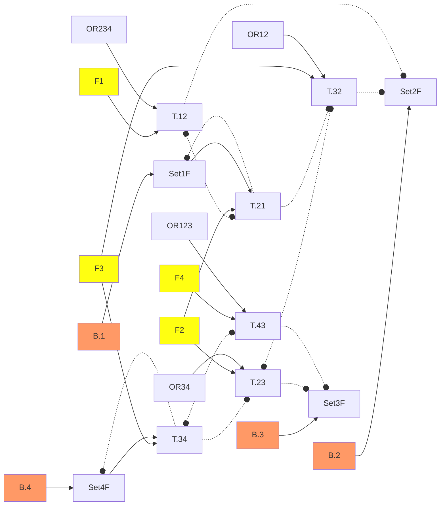

# new callSegment

```ex
[Sys]M = {U; D}  // Motor up / down
[Sys]B = { /* */ F1; F2; F3; F4 }   // Button.층 호출버튼
[Sys]S = {S1D; S2D; S2U; S3D; S3U; S4U}    // Sensor Up, Down
[Sys]My = {
    [accE] = {B; S}
    [accS] = {M}
    [macro=T] = {  //층간 이송 행위 Task
        A12 = { M.U ~ S.S2U }
        A23 = { M.U ~ S.S3U }
        A34 = { M.U ~ S.S4U }
        A43 = { M.D ~ S.S3D }
        A32 = { M.D ~ S.S2D }
        A21 = { M.D ~ S.S1D }
    }
    // 호출 Set기억 
    B.F1 > Set1F <| T.A21;
    B.F2 > Set2F <| T.A32;
          Set2F <| T.A12;
    B.F3 > Set3F <| T.A23;
          Set3F <| T.A43;
    B.F4 > Set4F <| T.A34;
    
    // 층간 상하강 행위간 인터락
    
    T.A12 <|> T.A21;
    T.A34 |> T.A23 <|> T.A32 <| T.A21;
    T.A34 <|> T.A43;
    
    //호출에 따른 층간 상하강 행위   
    T.A12 < (Set2F | Set3F | Set4F) & T.A21;
    T.A23 < (Set3F | Set4F) & (T.A12 | T.A32);
    T.A34 <  Set4F & (T.A43 | T.A23);
    T.A43 < (Set1F | Set2F | Set3F) & T.A34;
    T.A32 < (Set1F | Set2F) & (T.A23 | T.A43);
    T.A21 <  Set1F & (T.A12 | T.A32);
}
```


Legend
```
OR123 = Set1F | Set2F | Set3F
F2 = T.12 | T.32
```


