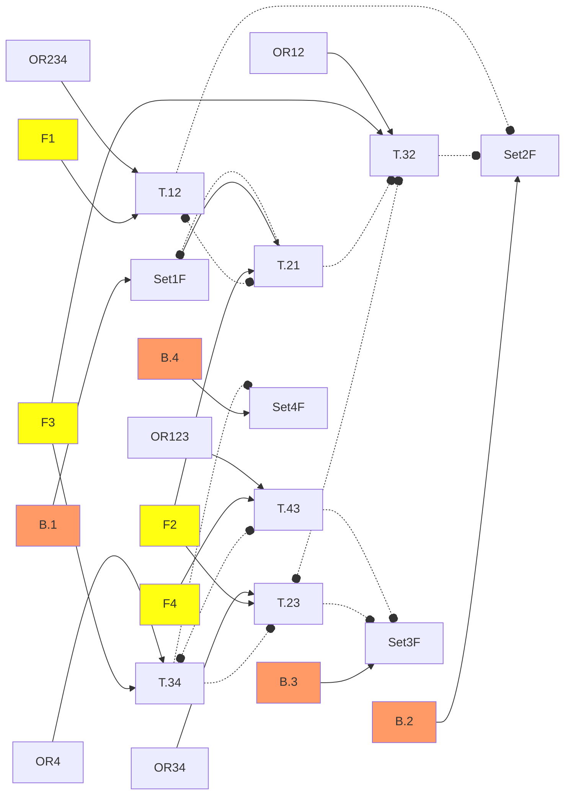

# new callSegment

```ex
[Sys]M = {U; D}  // Motor up / down
[Sys]B = {1; 2; 3; 4}    // Button.층 호출버튼
[Sys]S = {1D; 2D; 2U; 3D; 3U; 4U}    // Sensor Up, Down
[Sys]My =
    [accE] = {B; S}
    [accS] = {M}
    [macro=T] = {  //층간 이송 행위 Task
        12 = { M.U ~ S.2U }
        23 = { M.U ~ S.3U }
        34 = { M.U ~ S.4U }
        43 = { M.D ~ S.3D }
        32 = { M.D ~ S.2D }
        21 = { M.D ~ S.1D }
    }
    // 호출 Set기억 
    B.1 > Set1F <| T.21
    B.2 > Set2F <| T.32
          Set2F <| T.12
    B.3 > Set3F <| T.23
          Set3F <| T.43
    B.4 > Set4F <| T.34  
    
    // 층간 상하강 행위간 인터락
    
    T.12 <|> T.21
    T.34 |> T.23 <|> T.32 <| T.21
    T.34 <|> T.43
    
    //호출에 따른 층간 상하강 행위   
    T.12 < (Set2F | Set3F | Set4F) & T.21
    T.23 < (Set3F | Set4F) & (T.12 | T.32) 
    T.34 <  Set4F & (T.43 | T.23)
    T.43 < (Set1F | Set2F | Set3F) & T.34 
    T.32 < (Set1F | Set2F) & (T.23 | T.43)
    T.21 <  Set1F & (T.12 | T.32)
```


Legend
```
OR123 = Set1F | Set2F | Set3F
F2 = T.12 | T.32
```


