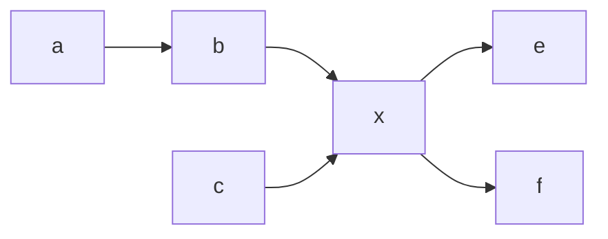

#### DAG 용어

- source (=init) segment:
    DAG 의 첫 시작 위치의 segment.  no incoming edge
- sink (=terminal) segment:
    DAG 의 마지막 위치의 segment.  no outgoing edge
- internal (=between) segment:
    source 및 sink 가 아닌 segment

- incoming edge : segment 기준으로 들어오는 edge
- outgoing edge : segment 기준으로 나가는 edge

- outgoing segment : segment 의 outgoing edge 에 연결된 segment
- incoming segment : segment 의 incoming edge 에 연결된 segment

###### Example
다음과 같은 DAG $G$ 가 있다고 할 때

sources(G) = {a, c}
sinks(G) = {e, f}
internals(G) = {b, x}
incoming_edges(a) = $\empty$
outgoing_edges(a) = {$a\rightarrow b$}
incoming_edges(e) = $\empty$
incoming_edges(x) = {$b\rightarrow x, c\rightarrow x$ }
outgoing_edges(x) = {$x\rightarrow e, x\rightarrow f$ }

outgoing_segments(x) = {e, f}

