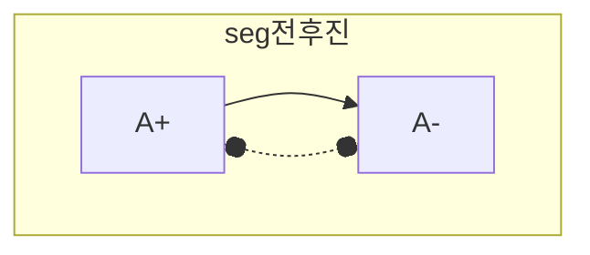
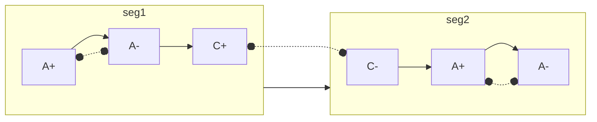

#### Children 원위치 찾기
Going Edges의 Start DAG 기준으로
- Child의 Reset이 뒤에서 오면 OFF
- Child의 Reset이 앞에서 오면 ON
- Child의 Reset이 방향을 모르면 None
- Child의 peer segments 들의 정보만으로 reset 을 결정할 수 없는 segment 들
- e.g child segments 중에서 "A+" 만 사용되고 "A-" 는 사용되지 않은 경우

Children 원위치 공식
- 행위는 복수개의 고유 값(원위치)를 가짐
- [OriginCalc](PPT/OriginCalc.pptx)  

#### 초기 위치 판정 Example
###### Example1

- `seg전후진` 의 children 의 시작 가능 상태는
    - A+ 의 reset 이 진행 순서상 뒤(A-) 에서 오기 때문에 OFF 이어야 하고,
    - A- 의 reset 은 진행 순서상 앞(A+) 에서 오기 때문에 ON 이어야 한다.
    - 판정시 reset 관계 해석은 children 내에서 존재하는 것으로만 한정한다.

###### Example2

- `seg1` 및 `seg2` 모두에서 A+ 및 A- 는 각 segment 내에서 reset 이 이루어지지만, `seg1.C+` 이나 `seg2.C-` 의 reset 관계는 해당 segment 의 외부에서 이루어지므로 이들은 초기 위치 판정에 관여하지 않는다.
    - Don't care condition