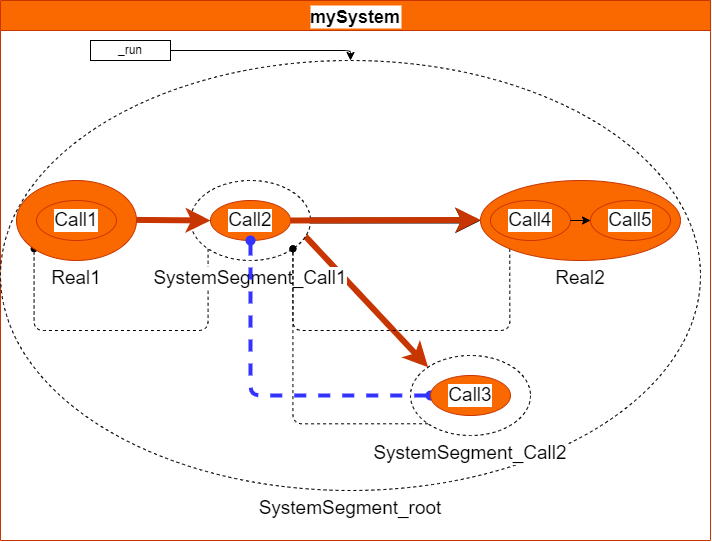

# 시스템 레벨 구동
1. Root에 CallSegment 존재시에 자동으로 [SystemSegment](./segment.md) 생성 및 해석 
2. 기본은 후행 reset (sink segment 는 외부 reset?)



```
[sys]mySystem = {Real1 > Call2 > Real2, Call3;
            Real1 = {Call1};            
            Real2 = {Call4 > Call5};
            Call1 = {Y1~X1};
            Call2 = {Y2~X2};
            Call3 = {Y3~X3};
            Call4 = {Y4~X4};
            Call5 = {Y5~X5};
}

[sys]blueSystem = {Y2 |> X3;
                   Y3 |> X2;
                }

```


