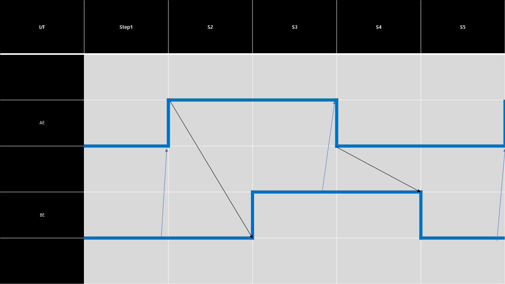
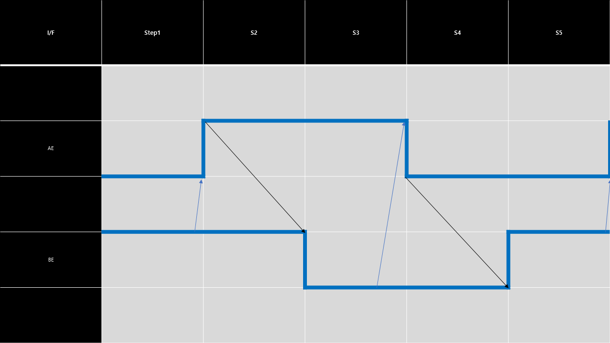

## A > B 2-Way HandShake

### Base Rule
1. A의 value가 On으로 변하면 B를 On 한다.
2. A의 value가 Off로 변하면 B를 Off한다.

#### A 
1. A는 B의 value가 0일때 자신의 value를 상승할 수 있다.
2. A는 B의 value가 1일때 자신의 value를 하강할 수 있다.
#### B 
1. B는 A의 value가 상승해야 자신의 value를 상승할 수 있다.
2. B는 A의 value가 하강해야 자신의 value를 상승할 수 있다.

## Extension - A > B 2-Way HandShake inversion

### Base Rule
1. A의 value가 On으로 변하면 B를 Off 한다.
2. A의 value가 Off로 변하면 B를 On 한다.
   
#### A 
1. A는 B의 value가 0일때 자신의 value를 하강할 수 있다.
2. A는 B의 value가 1일때 자신의 value를 상승할 수 있다.
#### B 
1. B는 A의 value가 하강해야 자신의 value를 상승할 수 있다.
2. B는 A의 value가 상승해야 자신의 value를 상승할 수 있다.