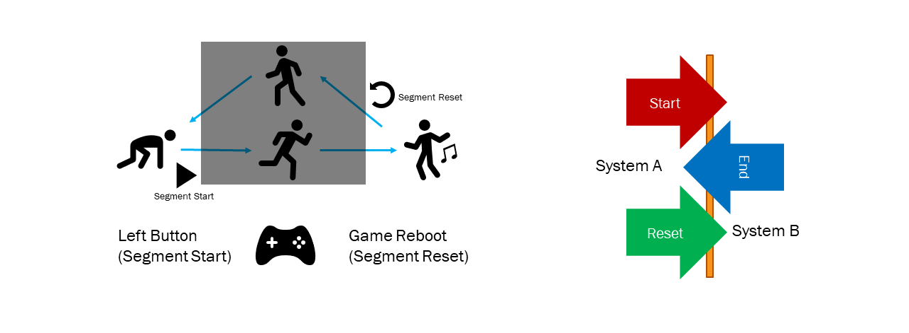
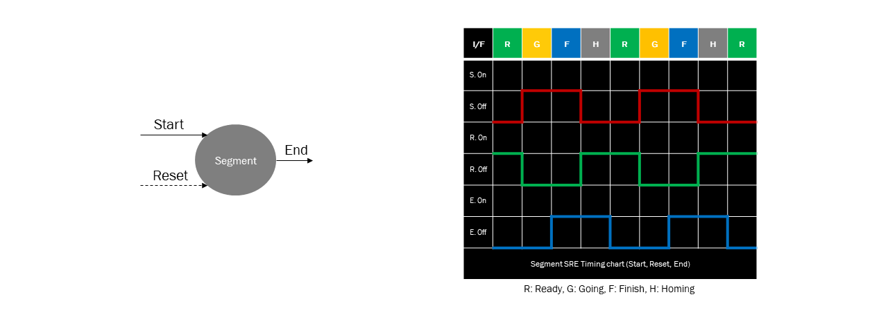
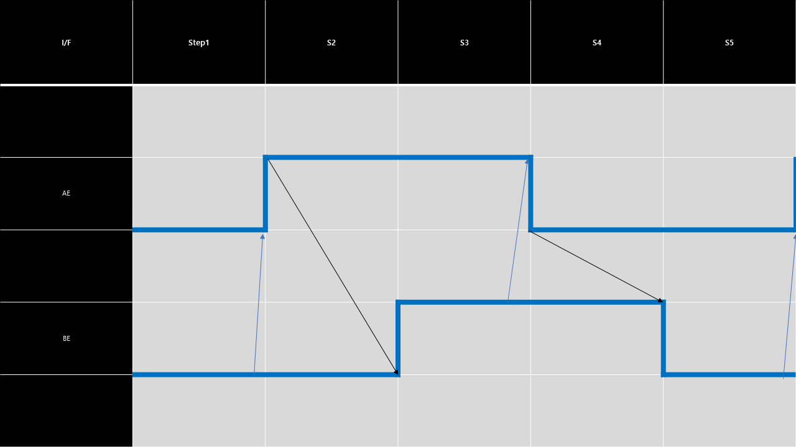
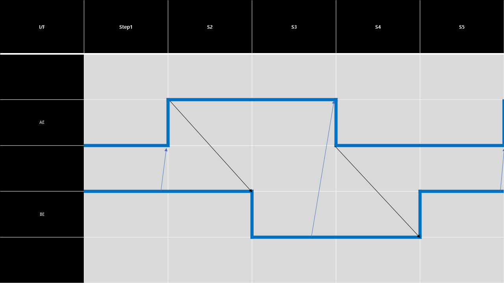

<!--
작성 후 문서 나눌것
-->

# Segment Timing Chart

## Segment 정의
#### Segment는 행위, 작업, 기능 등을 의미한다.

##### 게임 속 캐릭터가 동작 명령을 기다리고 있다.(Ready) 지정된 버튼을 누르고 있으면 캐릭터가 정해진 행동을 수행한다(Going). 단, 플레이어는 이 캐릭터가 움직이는 과정을 볼 수 없다. 대신 행동을 모두 마친 캐릭터는 자신이 해야 할 일을 끝마쳤다는 신호를 보내고 초기 상태로 돌아갈 준비를 한다(Finish). 재시작 버튼을 누르면 캐릭터는 다시 처음 명령을 기다리는 단계로 이동한다.(Homing)

##### Segment 시스템A (플레이어)는 Segment 시스템B(캐릭터)에게 Start 또는 Reset명령을 보낼 수 있다. 시스템B는 자신의 일을 마쳤다는 End신호를 표시하며 이는 A가 관측할 수 있다. B의 End신호를 통해 상태를 추측할 수 있기 때문에 B에서는 적절하게 Start, Reset신호를 받을 수 있다.

## Interface Timing Chart Case

    - Normal Segment에서만 정상적인 행위조작이 가능하다
    - 그 외의 Case는 매크로가 제공된다.

| Interface Case | Start | Reset| End |
|:--|:--:|:--:|:--:|
|**Normal**|O|O|O|

### Case1 : Normal Segment Interface

## A > B 2-Way HandShake

#### Rule

##### A - Active
1. A는 B의 value가 0일때 자신의 value를 상승할 수 있다.
2. A는 B의 value가 1일때 자신의 value를 하강할 수 있다.
   
##### B - Passive
1. B는 A의 value가 상승해야 자신의 value를 상승할 수 있다.
2. B는 A의 value가 하강해야 자신의 value를 상승할 수 있다.

|||
|:--|----:|
|B의 value를 반대로 변화시킬 수도 있다.||

  

