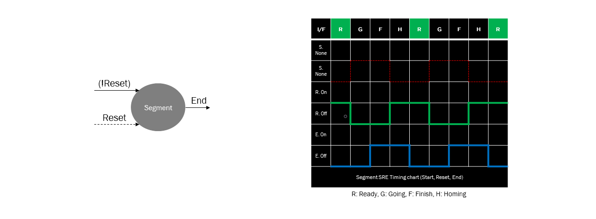
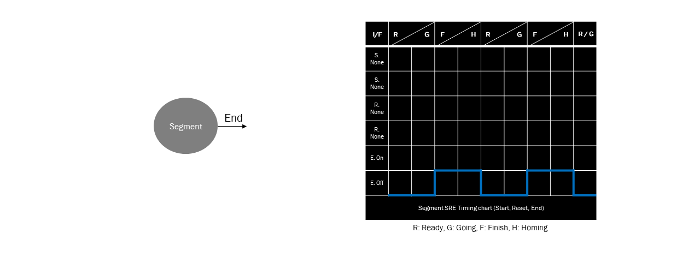
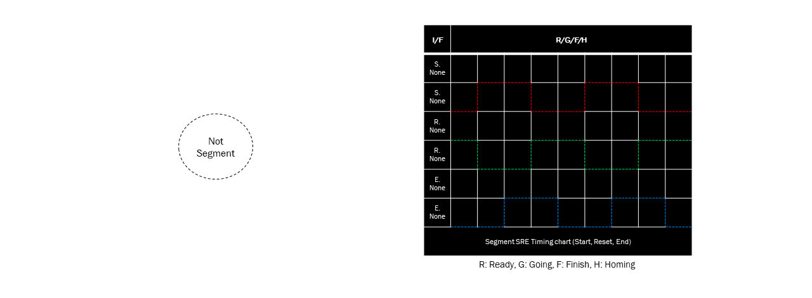
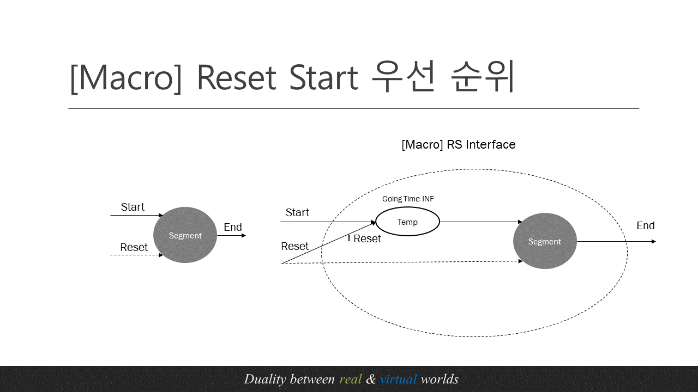
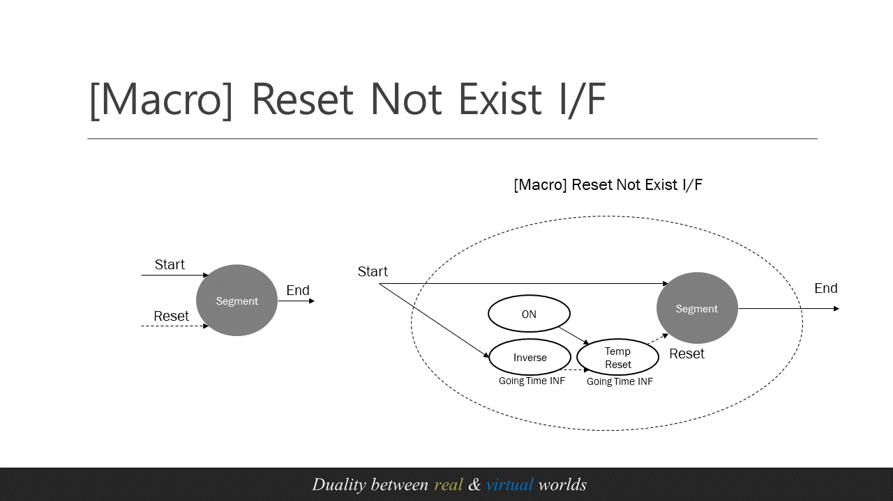

# Segment Timing Chart Extension

## Interface Timing Chart Case(Extension)

##### Segment Port(S/R/E)에 접근(Access)가능 여부에 따른 인터페이스 경우의 수는 8가지의 Case가 있다.
    - Interface Case1 경우를 제외하고 정상적인 행위조작이 불가
    - Case2~7은 정상 조작하기 위한 interface Macro 제공
    - Case8은 예외 Segment

| Interface Case | Start | Reset| End | 
|:--|:--:|:--:|:--:|
|**Case1**|O|O|O|
|**Case2**|O|X|O|
|**Case3**|X|O|O|
|**Case4**|X|X|O|
|**Case5**|O|O|X|
|**Case6**|O|X|X|
|**Case7**|X|O|X|
|**Case8**|X|X|X|

### Case1 : Normal Segment Interface

### Case2 : Reset not exist Interface

### Case3 : Start not exist Interface

### Case4 : Start/Reset not exist Interface

### Case5 : End not exist Interface

### Case6 : Reset/End not exist Interface

### Case7 : Start/End not exist Interface

### Case8 : S/R/E not exist Interface

## interface Macro 예시

### 1. Macro - Start Reset Priority

### 2. Macro - Reset Start Priority

### 3. Macro - Reset Not Exist Interface

