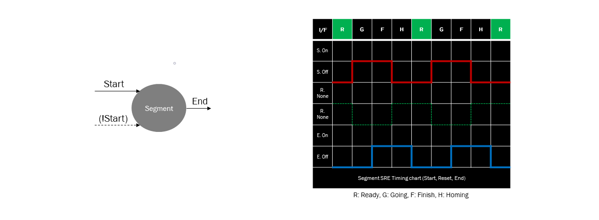
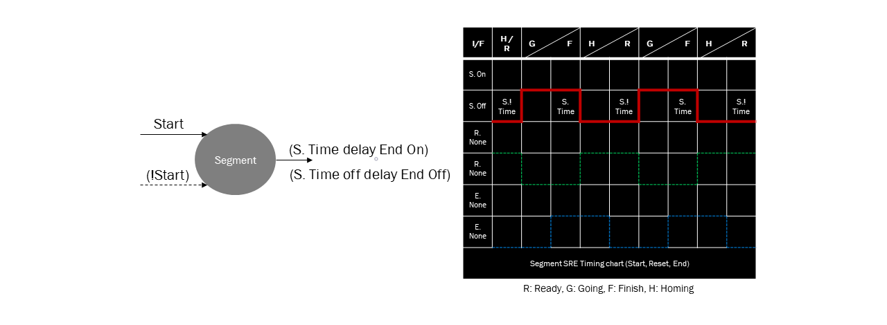

<!--
작성 후 문서 나눌것
-->

# Segment Timing Chart

## Interface Timing Chart Case(Extension)

##### Segment Port(S/R/E)에 접근(Access)가능 여부에 따른 인터페이스 경우의 수는 8가지의 Case가 있다.
    - Interface Case1 경우를 제외하고 정상적인 행위조작이 불가
    - Case2~7은 정상 조작하기 위한 interface Macro 제공

| Interface Case | Start | Reset| End | using|
|:--|:--:|:--:|:--:|:--:|
|**Case1**|O|O|O|normal|
|**Case2**|O|X|O|macro|
|**Case3**|X|O|O|macro|
|**Case4**|X|X|O|normal|
|**Case5**|O|O|X|function|
|**Case6**|O|X|X|function|
|**Case7**|X|O|X|function|
|**Case8**|X|X|X|not Use|

### Case1 : Normal Segment Interface

### Case2 : Reset not exist Interface
[macro 4.Interface If6](/Language/ds-language-table.md#43-single-operation)

### Case3 : Start not exist Interface
[macro 4.Interface If7](/Language/ds-language-table.md#43-single-operation)

### Case4 : Start/Reset not exist Interface

### Case5 : End not exist Interface
[function 3.2 Time Operation Op24](/Language/ds-language-table.md#32-time-operation)

### Case6 : Reset/End not exist Interface
[function 3.2 Time Operation Op24](/Language/ds-language-table.md#32-time-operation)

### Case7 : Start/End not exist Interface
[function 3.2 Time Operation Op24](/Language/ds-language-table.md#32-time-operation)

### Case8 : S/R/E not exist Interface

## Causal Model

### Causal Start Children

### Causal Reset Children

### Causal DAG Children

### Causal Fractal System

## Macro

### Macro - Start Reset Priority

### Macro - Reset Start Priority

### Macro - Reset Not Exist Interface

