<!--
작성 후 문서 나눌것
-->

# Segment Timing Chart (Ripple)

### Segment 정의
#### Segment는 행위, 작업, 기능 등을 의미한다.
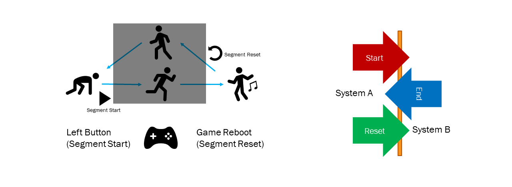

게임 속 캐릭터가 동작 명령을 기다리고 있다. 지정된 버튼을 누르고 있으면 캐릭터가 정해진 행동을 수행한다. 단, 플레이어는 이 캐릭터가 움직이는 과정을 볼 수 없다. 대신 행동을 모두 마친 캐릭터는 자신이 해야 할 일을 끝마쳤다는 신호를 보내고 초기 상태로 돌아갈 준비를 한다. 재시작 버튼을 누르면 캐릭터는 다시 처음 명령을 기다리는 단계로 이동한다.

Segment 시스템A (예시에서는 플레이어)는 Segment 시스템B(캐릭터)에게 Start 또는 Reset명령을 보낼 수 있다. 시스템B는 자신의 일을 마쳤다는 End신호를 표시하며 이는 A가 관측할 수 있다. B의 End신호를 통해 상태를 추측할 수 있기 때문에 B에서는 적절하게 Start, Reset신호를 받을 수 있다.

## Timing Chart Case

Segment는 크게 8가지의 Case가 있다.

| Interface Case | Start | Reset| End |
|:--|:--:|:--:|:--:|
|**Case1**|O|O|O|
|**Case2**|O|X|O|
|**Case3**|X|O|O|
|**Case4**|X|X|O|
|**Case5**|O|O|X|
|**Case6**|O|X|X|
|**Case7**|X|O|X|
|**Case8**|X|X|X|

### Case1 : Normal Segment Interface

### Case2 : Reset not exist Interface
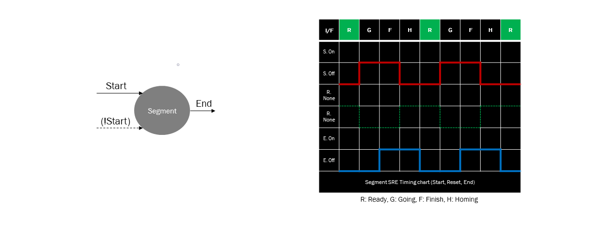

### Case3 : Start not exist Interface
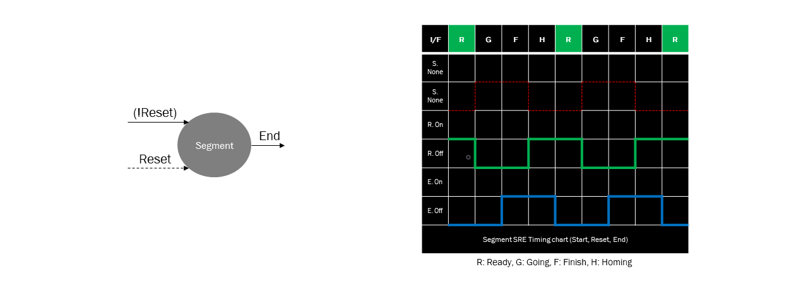

### Case4 : Start/Reset not exist Interface
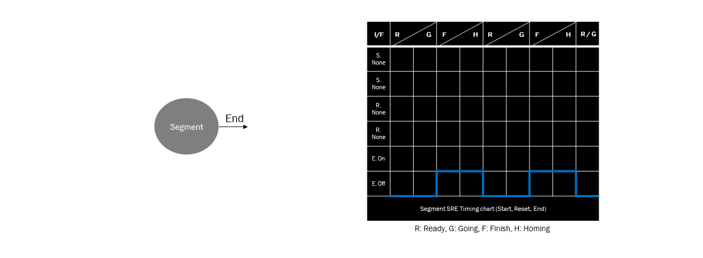

### Case5 : End not exist Interface
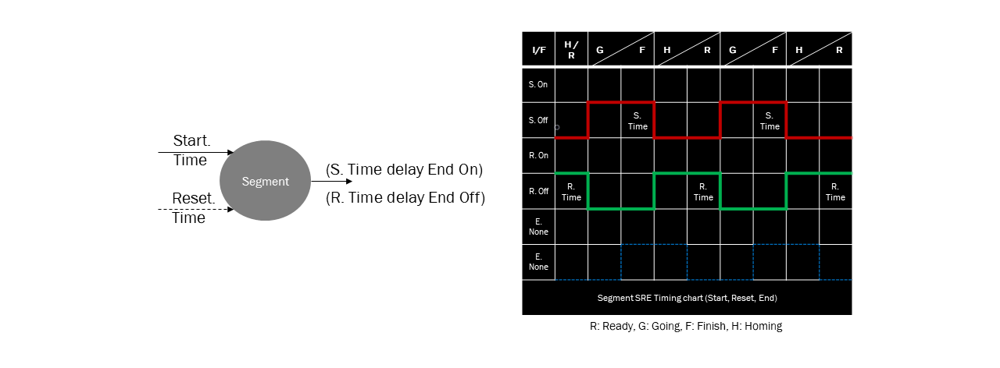

### Case6 : Reset/End not exist Interface

### Case7 : Start/End not exist Interface

### Case8 : S/R/E not exist Interface
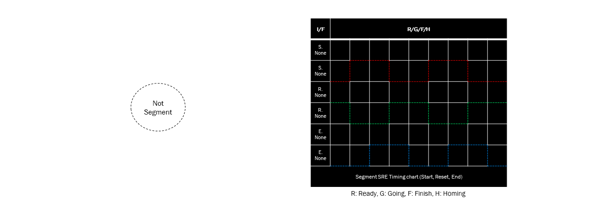

### Causal Start Children
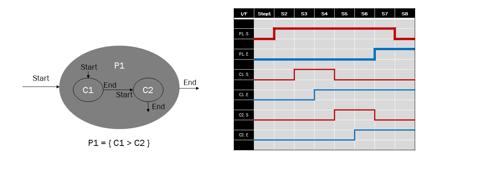
### Causal Reset Children
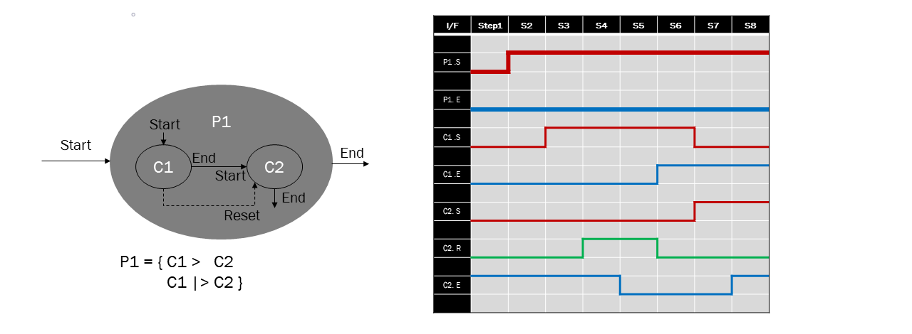

### Causal DAG Children

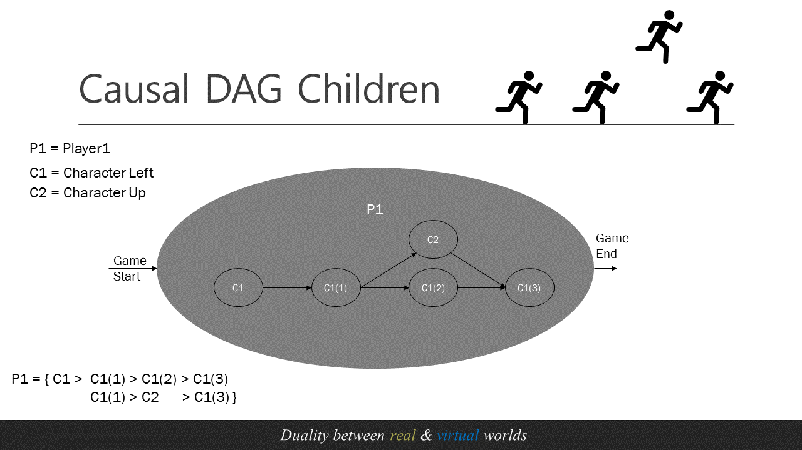

### Causal Fractal System

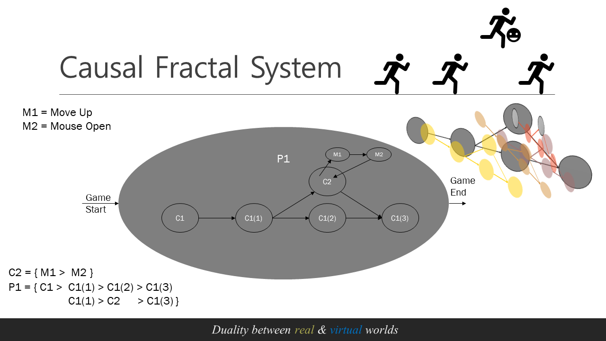

### Macro - Start Reset
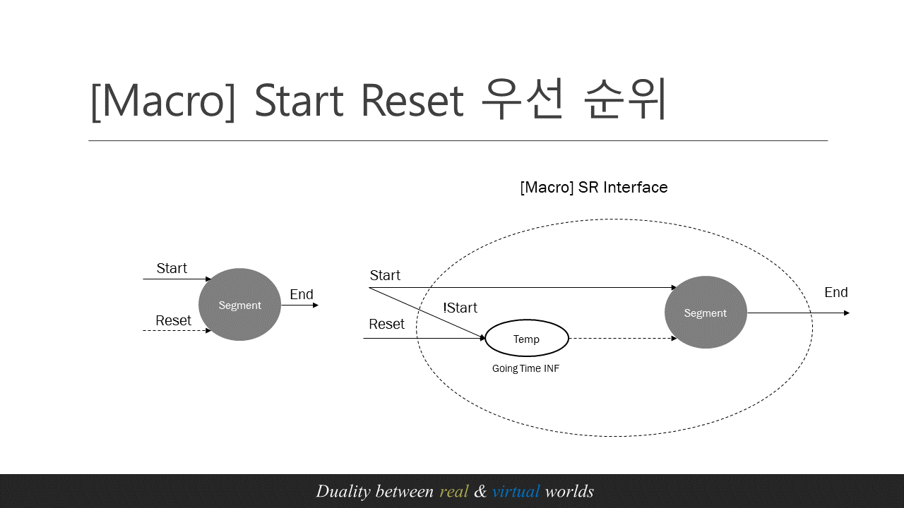
### Macro - Reset Start
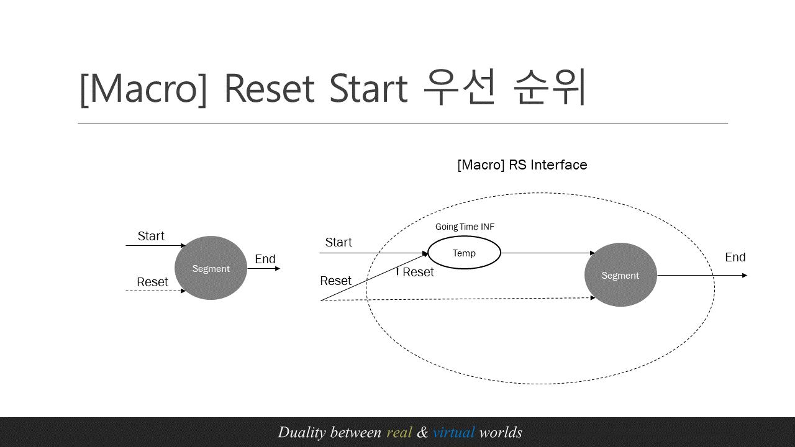
### Macro - Reset Not Exist I/F
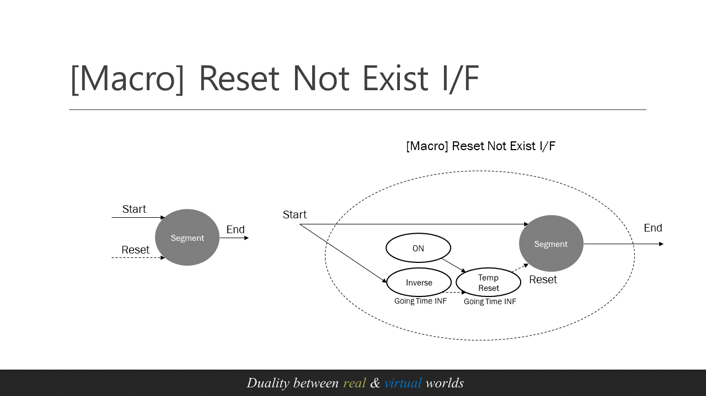
