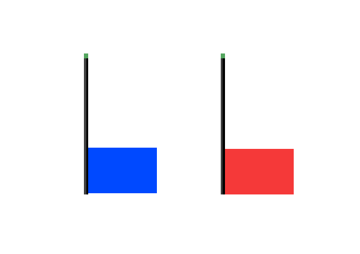
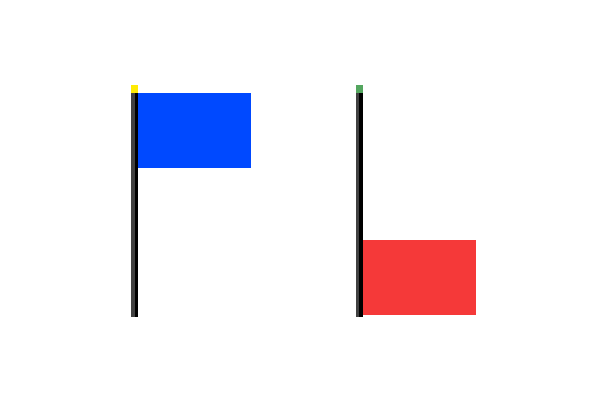
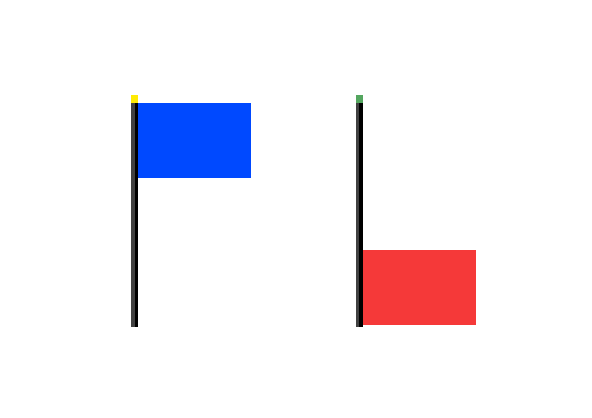
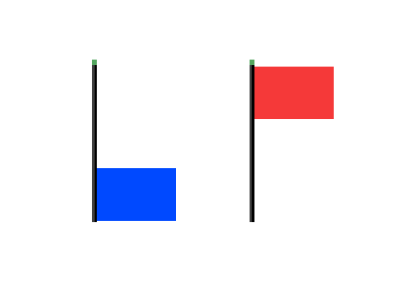
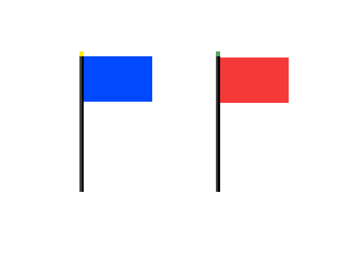
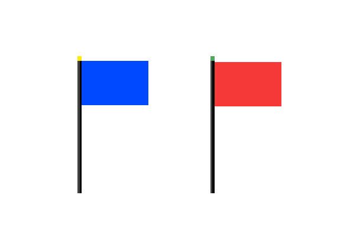

# DS Language FAQ 

:smile: Welcome to the DS world  :smile:

1. Causal (인과 정의)

| Num | Question :question:  | Answer     :exclamation: | Animation | 
|:--:| :-----: | ---- |  ---- |
|1.1 |A > B | After action A, action B 
`A행위 후 B행위`|| 
|1.2 |(A) > B | Action B if A value is true 
`A 값이 true인 경우 B 행위`|| 
|1.3 |(A) > @pushs (B) | Action B Start if A value is true, 
 Action B Pause if A value is false 
`A 값이 true인 경우 B 행위실행, A 값이 false인 경우 B행위멈춤`|| 

 

| Num | Question :question:  | Answer     :exclamation: | Animation |
|:--:| :-----: | ---- |  ---- | 
|1.4 |A \|> B | Reset B at the start of action A 
`A행위 시작시에 B리셋`|| 
|1.5 |(A) \|> B | Reset B if A value is true 
`A 값이 true인 경우 B리셋`|| 
|1.6 |(A) \|> @pushr (B)|Action B Start if A value is true, 
 Action B Pause if A value is false 
`A 값이 true인 경우 B 행위실행, A 값이 false인 경우 B행위멈춤`|| 

2. Call (행위 호출)

| Num | Question :question:  | Answer     :exclamation: 
|:--:| :-----: | ---- | 
|2.1 |C = {A ~ B} | Execution of action C starts A and completes when B ends  
`행위 C 실행은 A를 시작시켜 B가 종료되면 수행완료`|
|2.2 |C = {A, B ~ _} | Execution of action C is completed when A and B are started  
`행위 C 실행은 A, B를 시작시키면 수행완료`|
|2.3 |C = {_ ~ A, B} | Execution of action C is completed when A and B are finished
`행위 C 실행은 A, B가 종료되면 수행완료`|
|2.4 |C = {S ~ E ~ R} | Execution of action C starts S and completes execution when E ends, and initializes by executing R
`행위 C 실행은 S를 시작시켜 E가 종료되면 수행완료 하며 R을 수행시켜 초기화`

3. Flow  (행위 처리)

| Num | Question :question:  | Answer     :exclamation: 
|:--:| :-----: | ---- | 
|3.1 |[flow]F = { A > B > C } | flow F processes action B after action A and action C after action B.
`흐름 F는 A행위 후 B행위, B행위 후 C 행위를 각각 처리`|
|3.2|[flow]F = { A > B > C;
A = {A1 > A2 > A3};
B = {B1 > B2 > B3};
C = {C1 > C2 > C3}; } | Action D executes actions A, B, and C once in sequence.
`행위 A는 행위 A1, A2, A3를 차례로 한 번 실행`|
