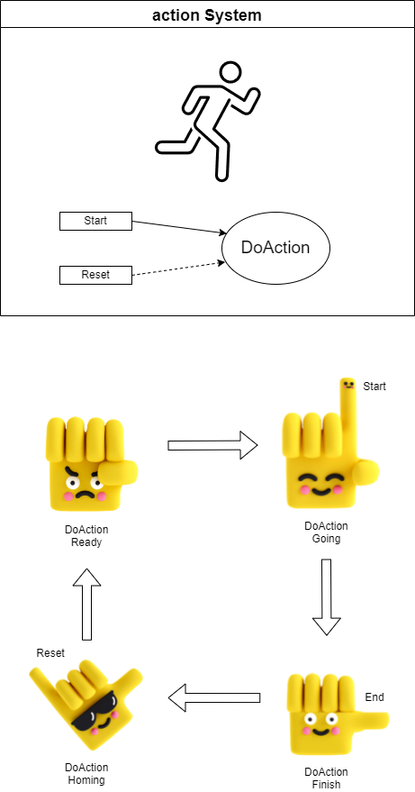

:smile: Welcome to the DS world  :smile:
# Example 1 

## action system :raising_hand:


 
 
  - action list 
    1. DoAction


```
     /* DS Language Unit
          1. '>'  is Start
          2. '|>' is Reset
          3. Action value(True/False) is End
     */

     //action system 
     [sys]action  = {
          [task] t = { start; reset; }
          [flow] f = {
               #(Start) > DoAction <| #(Reset);
          }
     }
```

