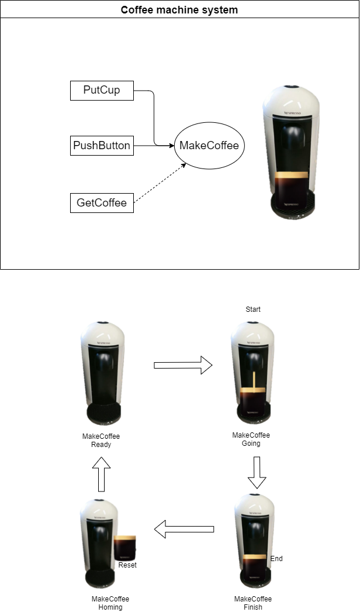

:smile: Welcome to the DS world  :smile:
# Example 2 

## coffee machine system :coffee:


 
 
  - action list 
     1. MakeCoffee
     

```
     [Sys]coffee  = {(PutCup), (PushButton) > MakeCoffee <| (GetCoffee)}
```
