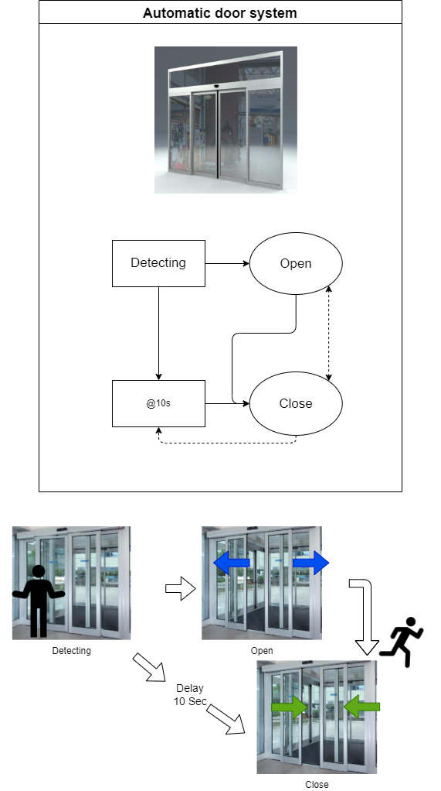

:smile: Welcome to the DS world  :smile:
# Example 3

## Automatic door system :door:


 
 
  - action list 
    1. Open
    2. Close

```
 [sys]door  = { Open <||> Close;
               (Detect) > Open, @s(10)  > Close;
               @s(10) <| Close
  }
```
