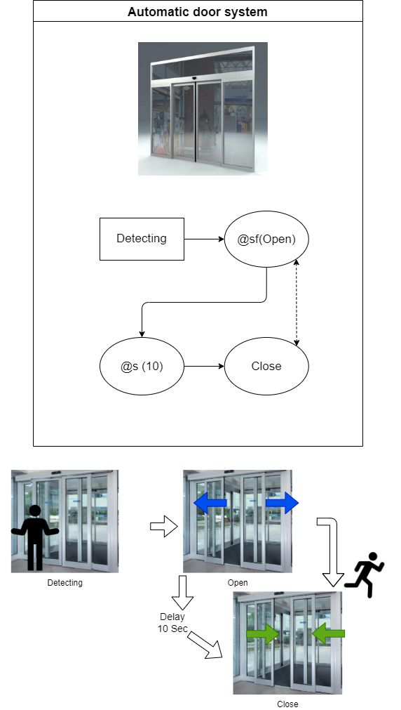

:smile: Welcome to the DS world  :smile:
# Example 3

## Automatic door system :door:


 
 
  - action list 
    1. Open
    2. Close

```
 [Sys]door  = { Open <|> Close
               (Detect) > Open, CloseDelay(10Sec)  > Close
               CloseDelay(10Sec) <| Close
  }
```
