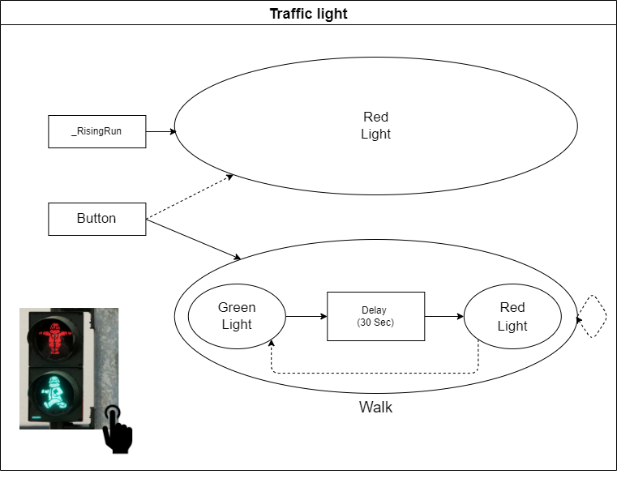

:smile: Welcome to the DS world  :smile:
# Example 4

## Traffic light system :traffic_light:


 
 
  - action list 
    1. RedLight
    2. GreenLight
    3. Walk


```
     [sys]trafficlight  = { RedLight <| (Button) > Walk <| Walk.End;
                            RedLight < _RisingRun;
          Walk = { GreenLight > @30 sec > RedLight } 
     }
```
