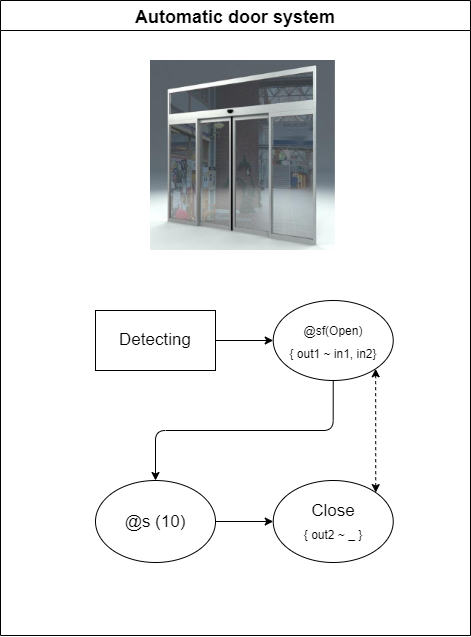

:smile: Welcome to the DS world  :smile:
# Example 5

## Automatic door system (Advance I/F) :door:


 
 
  - action list 
    1. Open
    2. Close

```
 [Sys]door  = { Open <||> Close
               (Detect) > Open, @10sec  > Close
               @10 sec <| Close

      Open = { Out1 ~ In1, In2 }
      Close = { Out2 ~  }
  }
```
