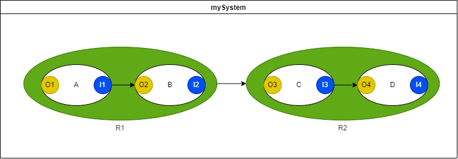

# DS text language spec


## 주요스펙 

### 1 모델링 기본 유닛
  - 모든 유닛 참고 [language-table](./ds-language-table.md)

| Item | Unit |Example|   Desc | 
|:---:|:----:|:--:|:---:|
|최소단위 Segment(행위) 정의|call = { `~` } |A = {O1 ~ I1}| A 행위는 Q 를 시켜 I 를 관찰|
|Segment(행위)레벨 인과 정의|real = { `>` } |R1 = {A > B}| R 행위는 A행위 수행후 B 행위를 수행|
|System(시스템)레벨 인과 정의|[sys]name = { `>` } | S = {R1 > R2}| S 시스템은 R1행위 관찰 후 R2 시작명령|
 - 해석 규칙
   - Segment(행위)레벨 행위 절차  :  정의된 내부 각자행위들을 순차(Step)적으로 1회 수행함
   - System(시스템)레벨 행위 절차 :  정의된 내부 각자행위들을 조건(Condition)으로 수행함
</BR>
 - Text edit 처리 규칙 참고 [Antlr (`g4`) spec](/DSVS/dsvse/server/src/ds.g4)

 ```
1. 모든 행위 이름 및 시스템 예약어 대소문자 구분   ex) test <> Test, [Sys] <> [SYS] 서로 다름
2. 띄어쓰기 대신 '_' 사용                         ex) 가공 작업 => 가공_작업
3. 이름시작에 '_' 및 숫자 금지                    ex) _test (X), 1cycle (X)
4. 라인 종료시에 ';' 작성                         ex) R1 =  {A > B};
 ```
</BR>

```ex)

[sys]S = {R1 > R2;
   R1 =  {A > B};
   R2 =  {C > D};
          A = {O1 ~ I1};
          B = {O2 ~ I2};
          C = {O3 ~ I3};
          D = {O4 ~ I4};
      };
    
```

- 기본 예제 참고  - [예제](/Examples/ex1.md) 참고

</BR>


### 2 모델링 확장 유닛


- Edge Reset 기호 '|>', '<|', '<||>'
  - Ex) A |> B  의미 : A실행(Going)시 B Reset
  - Ex) A <||> B 의미 : A실행(Going)시 B Reset, B실행(Going)시 C Reset

 - Real Segment 정의 방법 : indent (\t) 이후 이름 = {edge1;edge2;...;edgeN;} 형식으로 정의

    - Ex) RealSeg1 = {Seg1 > Seg2; Seg1 > Seg3; Seg1 <|> Seg2; }
    - Real Segment 는 CallSegment를 Child로 등록 가능하다. (CallSegement는 주로 라이브러리 형태로 미리제공예정)
    - 예약어 [arrH] 입력 받으시 Homing 인과로 추가해석 (Start Edge 만 가능)

 - Call Segment 정의 방법 : indent (\t) 이후 이름 = { System.SegA, System.SegB~System.SegC } 형식으로 정의

    - Ex) CallSeg1 = {Sys.A,Sys.C ~ Sys.B}  (A,C 동시 실행후 B 완료관찰)
</BR>

- Macro 확장 가능 - [macro.md](/Doc/Terminologies/macro.md) 참고
- 확장 예제 참고  - [예제](/Examples/ex5.md) 참고
</BR>

- 구성 요소
  - DsSystem : Root Segment Edges
    - indent 없이 [sys]SystemName = {children segments edge List} (edge없을시 ';' 로 구분하여 행위만 나열)
      - brace '{}' 내부의 child 구분자는 `;` or line break
      - child segment 하부의 segment 는 위 목록에 기술하지 않음.  해당 child segment 정의에서 기술
    - indent 후 하부에 child segment 에 대한 세부 정의 및 속성 정의
    - indent 는 스페이스만 사용할 것을 권장.  TAB 혼재될 경우, 하나의 TAB 은 항상 space 4개로 해석한다.
  - (Child) Segment Edges (Real Segment는 Root에만 존재 가능)
    - SegmentName = {children segments edge List} (edge없을시 ';' 로 구분하여 행위만 나열)
    - CallSegment : <타시스템 이름>.<타시스템 대상 root segment>
      - e.g : `Cylinder.Adv` : Cylinder 시스템의 전진 segment
      - Child 가 DAG 인 경우의 정의 방법  ( '~' 기호로 참고 )
        - dag1 =   { Valve.V+, Valve.Open ~ Sensor.S+ }
  - Properties
    - [bracket 내부에 속성 명 정의] = {속성 세부 사항}
    - 현재 정의된 속성명
      - accXYZ : XYZ 는 S/R/E 의 조합.  e.g accS, accSRE, accRE, ... 등 총 7가지
      - arrG : Going 인과 : 행위 Start Edge / 행위 Reset Edge 혼용  [arrG] 생략가능
      - arrH : Homing 인과(안전복귀인과)  : 행위 Start Edge 전용
    - 추가 확장 필요한 속성명
      - ?? exportXYZ : XYZ 는 S/R/E 의 조합.   타 시스템이 해당 segment 의 S/R/E 를 볼 수 있는지 여부
    - 인과 정의
      - `>` or `<` 인과 순서
      - `|>` or `<|` or `<||>` reset 인과
      - `,` 는 and(&) 관계.  인과 방향성보다 우선순위가 높음
        - e.g `Sys1.A, Sys2.A > X;`
      - 인과 정의의 마지막은 semicolon(`';'`) 로 끝나야 한다.
  - 주석.  `//` 로 시작하는 line comment or `/*` 와 `*/` 의 block comment

