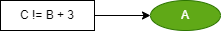

# DS text language table (#system Macro)

##  syntax :  #name ( , , ...)

### 1. Value operation (행위 값을 이용한 연산)

|Id| Item | Unit | Example| Desc |  GUI |
|:---:|:----|:-------:|:---:|:----|:---|
|OP1|End  Value | #( ) or () | `#(Seg), A > B`  | Basically, actions placed in parentheses () are treated as end values
Action B would be executed by causal action A and the value of action SEG(end port of segment) is 'True'
`기본적으로 괄호() 안에 쓰여진 행위는 값으로 취급한다`
`행위 B는 행위 A가 실행되고, 행위 SEG의 end port 값이 'True'일 때 수행`    ||
|OP2|End Set Value | #set| `#set (Seg) > B` | #set (SEG) is set to 'True' when the end port value of the action SEG becomes 'True', and is maintained regardless of the change in the action SEG thereafter
Action B is executed when the value of #set (SEG) is 'True', and automatically resets the value of #set (SEG) during execution without any user setting
`#set (SEG)는 행위 SEG의 end port 값이 'True'가 되면 'True'로 설정되며, 이후 행위 SEG의 변화와 무관하게 유지됨`
`행위 B는 #set (SEG)의 값이 'True'일 때 실행되며, '사용자가 설정하지 않아도' 실행중에 #set (SEG)의 값을 리셋함`||
|OP3|End Latch Value | #latch( , )| `#latch((SegA), #g (SegB)) > B` | #latch (SEG, #g(B)) is set to 'True' when the end port value of the action SEG becomes 'True', and is maintained regardless of the change in the action SEG thereafter
Action B is executed when the value of #latch (SEG, #g(B)) is 'True', and resets the value of #latch (SEG, #g(B)) during execution by user set #g(B)
`#latch (SEG, #g(B))는 행위 SEG의 end port 값이 'True'가 되면 'True'로 설정되며, 이후 행위 SEG의 변화와 무관하게 유지됨`
`행위 B는 #latch (SEG, #g(B))의 값이 'True'일 때 실행되며, '사용자가 설정한 #g(B)에 의해' 실행중에 #set (SEG)의 값을 리셋함`  ||
|OP4|Going Status|#g |`#g(Seg) > B`| Action B would be executed by Action SEG is executing(status going)
`행위 B는 행위 SEG가 실행중(going상태)일 때 실행됨`||
|OP5|Homing Status|#h |`#h(Seg) > B` | Action B would be executed by Action SEG is executing(status homing) 
`행위 B는 행위 SEG가 리셋중(homing상태)일 때 실행됨`||

 

### 2. Comparision operation (비교연산) 

|Id| Item | Unit | Example| Desc |  GUI |
|:---:|:----|:--:|:---:|:----|:---|
|OP6|Equals|#( == )|#(B == 3) > A| Action A is executed when the value of action B is equals to 3
`행위 A는 행위 B의 값이 3일 때 실행됨` |    |
|OP7|Not equals |#( != )|#(B != 3) > A| Action A is executed when the value of action B is not equals to 3
`행위 A는 행위 B의 값이 3이 아닐 때 실행됨` |    |
|OP8|Greater than |#( > )|#(B > 3) > A| Action A is executed when the value of action B is greater than 3
`행위 A는 행위 B의 값이 3보다 클 때 실행됨` |    |
|OP9|Less than|#( < )|#(B < 3) > A| Action A is executed when the value of action B is less than 3
`행위 A는 행위 B의 값이 3보다 작을 때 실행됨` |    |
|OP10|Greater Equals than |#( >= )|#(B >= 3) > A| Action A is executed when the value of action B is greater than or equals to 3
`행위 A는 행위 B의 값이 3이상일 때 실행됨`|    |
|OP11|Less Equals than|#( <= )|#(B <= 3) > A| Action A is executed when the value of action B is less than or equals to 3
`행위 A는 행위 B의 값이 3이하일 때 실행됨`|    |

 

### 3. Arithmetic operation(산술연산)

|Id| Item | Unit | Example| Desc |  GUI |
|:---:|:----|:--:|:---:|:----|:---|
|OP12|Addition | + | #(C != B + 3) | Action A is executed when 'C' is not equals to 'B plus 3'
`행위 A는 C가 B와 3을 더한 결과와 같을 때 실행됨` | |
|OP13|Subtraction|- |#(C > B - 3)| Action A is executed when 'C' is not equals to 'B minus 3'
`행위 A는 C가 B와 3을 뺀 결과와 같을 때 실행됨` | |
|OP14|Multiplication | * | @(C =  B * 3)  | Action A is executed by action C assigned 'B multiplied by 3'
`행위 A는 B와 3의 곱연산이 할당된 행위 C에 의해 실행됨` | |
|OP15|Division|/ | #(C ==  B / 3) | Action A is executed when the value of action C equals to 'B divided by 3'
`행위 A는 C가 B와 3을 나눈 결과와 같을 때 실행됨` | |

 

### 4. Logical operation(논리연산)

|Id| Item | Unit | Example| Desc |  GUI |
|:---:|:----|:--:|:---:|:----|:---|
|OP16| And | && | #(A&&B) > C | C would be executed when the end of A and B are true | |
|OP17| Or | \|\| | #(A\|\|B) > C | C would be executed when the end of A or B are true | |
|OP18| Not | ! | #(!A) > B | C would be executed when the end of A is not true | |
|OP19| XOR | #xor( , ) | #xor(B, C) > A | A would be executed when the XOR (end of B, end of C) is true ||
|OP20| NXOR | #nxor( , ) | #nxor(B, C) > A | A would be executed when the NXOR (end of B, end of C) is true ||
|OP21| NAND | #nand( , ) | #nand(B, C) > A | A would be executed when the NAND (end of B, end of C) is true ||
|OP22| NOR | #nor( , ) | #nor(B, C) > A | A would be executed when the NOR (end of B, end of C) is true ||
 

### 5. Data conversion(값 형식 변환)

|Id| Item | Unit | Example| Desc |  GUI |
|:---:|:----|:--:|:---:|:----|:---|
|OP23| Numeric  | #num ()   |` #(65 < #num (B)) ` | Compares the numerically converted B is greater than 65  ||
|OP24| String  |#str ()   | ` @(C = #str (B)) `  | Assign the result of convert B to string into the action C  | |
|OP25| BCD  | #bcd ()   |` @(C = #bcd (B)) `   | Assign the result of convert B to BCD into the action C  ||
|OP26| BIN  | #bin ()  |` @(C = #bin (B)) ` | Assign the result of convert B to BIN into the action C  ||

 

### 6. Calculation operation

|Id| Item | Unit | Example| Desc |  GUI |
|:---:|:----|:--:|:---:|:----|:---|
|FUN1|Abs | #abs  | #(65 == #abs (A))  | Calculate the absolute value of A. ||
|FUN2|Sin| #sin|#(65 == #sin (A))| Calculate the SIN value of A. ||
|FUN3|Round | #round | #(65 == #round (A)) | Calculate the rounding of A.  || 
