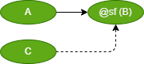
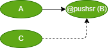

# DS text language table (@ segment Macro)

##  syntax :  @name ( , , ...)

### 1. Priority operation
- Start 와 Reset 신호가 동시에 ON 인 경우, 어떤 신호를 우선으로 해석할지의 여부 정의

|Id| Item | Unit | Example| Desc | GUI |
|:---:|:----:|:--:|:---:|:----|:---|
|IF0|Reset 우선(default) |  | A > B <\|C;  | A 와 C 가 동시에 ON 인 경우, reset 조건인 C 우선 | |
|IF1|Start Priority | @sf | A > @sf (B) <\|C;  | Start 신호 우선  ~Start signal of B would be cutoff when action C is executing~  Start wins on race condition | |
|IF2|Last Priority  |  @lf  | A > @lf (B) <\|C; | Action B operates based on the last signal received among the start and reset signals | |
 

### 2. Push-button-like operation

|Id| Item | Unit | Example| Desc | GUI |
|:---:|:----:|:-----:|:---:|:----|:---|
|IF3|Start Sustain | @pushs() | A > @pushs (B);  | The start signal of B sustains only lasts while action A is in the finish state |  |
|IF4|Reset Sustain | @pushr() | A > @pushr (B);  | The reset signal of B sustains only lasts during action A executing |  |
|IF5|SR Sustain | @pushsr | A > @pushsr (B)  <\| C; | In this case also, the priority of reset signal is higher than the start signal |  |

 

### 3. Single  operation

|Id| Item | Unit | Example| Desc | GUI |
|:---:|:----:|:--:|:---:|:----|:---|
|IF6|Start Single | @onlys()| A > @onlys (B);  | Action B is executed only lasts during action A is in the finish status, and reset when the action A's status is changed |  |
|IF7|Reset Single | @onlyr()| A \|> @onlyr (B);  | Action B is executed only lasts during action A is executing, and reset when the action A's status is changed |  |
|IF8|Self Start | @selfs()| @selfs (B) > A;   | Action B would be restart itself after reset |  |
|IF9|Self Reset | @selfr()| A > @selfr (B);    | Action B would be reset itself after finish |  |
 

### 4. Data operation(데이터 처리)

|Id| Item | Unit | Example| Desc |  GUI |
|:---:|:----:|:--:|:---:|:----|:---|
|IF10|Copy | `=` | `A > @(C = B);`  | The action copying B into C would be executed after action A has finished||
|IF11|Initialize|`=` |`#(A < 65) > @(A = 65);`| Initialization case of A ||

 

### 5. Time operation(시간연산)

|Id| Item | Unit | Example| Desc |  GUI |
|:---:|:----:|:--:|:---:|:----|:---|
|IF12|On Delay(Start Edge Only) | @ms, @s| A > @ms (500) > B;  | B would be executed after 500 msec from the finish of action A||
|IF13|Off Delay |None || Use On Delay    ||

 
