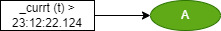

# DS text language table (_system Unit)

##  syntax :  _name / ' ' / Numeric

### 1.  Constain

|Id| Item | Unit | Example| Desc |  GUI |
|:---:|:----|:--:|:---:|:----|:---|
|SYS1|Numeric | 1,2,...  | #(C == 3) > A  | Action A would be executed when C equals to number 3 | |
|SYS2|String |' ' | #('C'== B) > A| Action A would be executed when B equals to string C| |

### 2.  system flag

|Id| Item | Unit | Example| Desc |  GUI |
|:---:|:----|:--:|:---:|:----|:---|
|SYS3|Always On | _on | _on > A  | A is executed by system bit '_on' | |
|SYS4|Always Off |_off | _off > A| A is executed by system bit '_off' | |
|SYS5|Running Flag |_run | _run > A| A is executed by system bit '_run' | |
|SYS6|Stop Flag |_stop | _stop > A| A is executed by system bit '_stop'| |
|SYS7|Running Rising |_runr | _runr > A | A is executed by system bit '_runr'| |
|SYS8|Running Falling |_runf | _runf > A | A is executed by system bit '_runf' | |

### 3.  system timer

|Id| Item | Unit | Example| Desc | GUI |
|:---:|:----|:--:|:---:|:----|:---|
|SYS9|Toggle #s | #_toggles () or #_togglems() | #_togglems (50) > A  | Every 50 msec, The value of '#_toggles (50)' toggles true and false |  |
|SYS10|Current Time | #_currt (t/d/dt) | (#_currt (t) > '23:12:22.124') > A | If the current time passes '23:12:22.124', action A |  |

