# DS text language table
## 1. Sequence
### 1.1 Causal(원인결과 정의)
|Id| Item | Unit |Example|   Desc |  GUI | 
|:---:|:----|:--:|:---:|:----|:---|
|SEQ1|Start Causal|`>`| `A > B > C` |Action B would be executed by causal action A, action C would be executed by causal action B  
`B행위는 A행위에 의해 실행되며, C행위는 B행위에 의해 실행됨`| 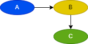|
|SEQ2|Reset Causal| \|> | A > B <\| C|Action B would be executed by causal action A, and the action B would be initialized(reset) by causal action C 
`B행위는 A행위에 의해 실행되며, C행위에 의해 리셋됨`| 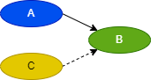|
|SEQ3|And Causal|`,`|`A,B,C > D,E` | Action D would be executed by united causal action A, B and C and also action E would be executed by same causal actions as D 
`D, E행위는 A행위, B행위, C행위에 의해 실행됨`|  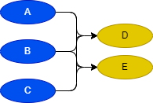|
|SEQ4|Or Causal|\|\|| A, B \|\| C > D | Action D would be executed by causal action A and B
 Or action D would be executed by causal action C 
`D행위는 A행위, B행위에 의해 실행되거나, C행위에 의해 실행됨`| 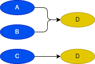|
|SEQ5|Causal Split|`;`| `A,B > D;`
`C > D;` | Action D would be executed by causal action A and B
 Or action D would be executed by causal action C 
`D행위는 A행위, B행위에 의해 실행되거나, C행위에 의해 실행됨`| 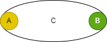|

 

### 1.2 Call(행위 부르기)

|Id| Item | Unit | Example | Desc |   GUI | 
|:---:|:----|:--:|:----|:---|:---|
|SEQ6|Call | `~` |`C = {A ~ B}`
 `C = {_ ~ B}` 
 empty key is `_` | Upper - Action C calls the action A to execute the DA셋(A ~ B), and indicates the state of action B
Lower - Action C just indicates the state of action B without executing
`C행위는 A를 실행시키며, B의 상태를 나타냄`
`C행위는 B의 상태만을 나타냄`| 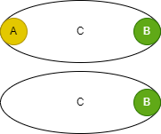|
|SEQ7|And Call|`,`| `F = {A,B,C ~ D,E}`|Action F calls the action A, B and C to execute the DAG(A,B,C ~ D,E), and indicates the state of action D and E
`F행위는 A, B, C를 실행시키며, D, E의 상태를 나타냄`| 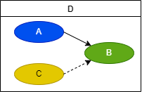
|SEQ8|Reset Call|`~ ~`| `H = {A,B,C ~ D,E ~ F,G}`|Action H calls the action A, B and C to execute the DAG(A,B,C ~ D,E), or calls the action F, G to reset the state of action D and E
And indicates the state of action D and E
`F행위는 진행을 위해 A, B, C를 실행시키거나 리셋을 위해 F, G를 실행시킬 수 있고, 이에 따라 변화되는 D, E의 상태를 나타냄`| 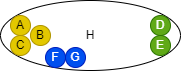|

 

### 1.3 Parent(행위 부모 할당)

|Id| Item | Unit | Example | Desc |   GUI | 
|:---:|:----|:--:|:----|:---|:---|
|SEQ9|system Parent | `[sys]=` |  [sys]D = { A > B <\| C } | System D parallelly processes the actions included in the causality DAG
`시스템 D는 인과 그래프(DAG)에 포함된 행위들을 '병렬'적으로 처리함`  | 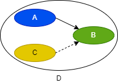|
|SEQ10|Segement Parent| `=` |  D = { A > B <\| C } | Action D sequentially processes the actions included in the causality DAG
`행위 D는 인과 그래프(DAG)에 포함된 행위들을 '순차'적으로 처리함` | 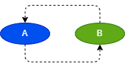|
 

### 1.4 Causal Extension (행위 확장)

|Id| Item | Unit | Example | Desc |   GUI | 
|:---:|:----|:--:|:----|:---|:---|
|SEQ11| mutual interlock | <\|\|> |  A <\|\|> B 
is equal to A <\| B ; A \|> B| Action A and Action B are linked in a mutually exclusive interlock
`A 행위와 B 행위는 상호 배타적인 인터락으로 연결되어 있음`  | 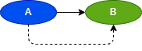|
|SEQ12| resetStart | \|>> |  A \|>> B 
is equal to A > B ; A \|> B| Action B would be executed by the end of causal action A
And also B would be initialized(reset) by executing causal action A
`B행위는 A행위에 의해 실행되며, A행위의 실행중에 리셋됨` | |

 

## 2. Data
산

### 2.1 Value operation (행위 값을 이용한 연산)

|Id| Item | Unit | Example| Desc |  GUI |
|:---:|:----|:-------:|:---:|:----|:---|
|OP1|End  Value | ( ) | `(Seg), A > B`  | Action B would be executed by causal action A and the value of action SEG(end port of segment) is 'True'
`행위 B는 행위 A가 실행되고, 행위 SEG의 end port 값이 'True'일 때 수행`    |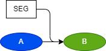|
|OP2|End Set Value | #set| `#set (Seg) > B` | #set (SEG) is set to 'True' when the end port value of the action SEG becomes 'True', and is maintained regardless of the change in the action SEG thereafter
Action B is executed when the value of #set (SEG) is 'True', and automatically resets the value of #set (SEG) during execution without any user setting
`#set (SEG)는 행위 SEG의 end port 값이 'True'가 되면 'True'로 설정되며, 이후 행위 SEG의 변화와 무관하게 유지됨`
`행위 B는 #set (SEG)의 값이 'True'일 때 실행되며, '사용자가 설정하지 않아도' 실행중에 #set (SEG)의 값을 리셋함`||
|OP3|End Latch Value | #latch( , )| `#latch((SegA), #g (SegB)) > B` | #latch (SEG, #g(B)) is set to 'True' when the end port value of the action SEG becomes 'True', and is maintained regardless of the change in the action SEG thereafter
Action B is executed when the value of #latch (SEG, #g(B)) is 'True', and resets the value of #latch (SEG, #g(B)) during execution by user set #g(B)
`#latch (SEG, #g(B))는 행위 SEG의 end port 값이 'True'가 되면 'True'로 설정되며, 이후 행위 SEG의 변화와 무관하게 유지됨`
`행위 B는 #latch (SEG, #g(B))의 값이 'True'일 때 실행되며, '사용자가 설정한 #g(B)에 의해' 실행중에 #set (SEG)의 값을 리셋함`  |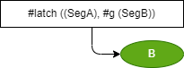|
|OP4|Going Status|#g |`#g(Seg) > B`| Action B would be executed by Action SEG is executing(status going)
`행위 B는 행위 SEG가 실행중(going상태)일 때 실행됨`||
|OP5|Homing Status|#h |`#h(Seg) > B` | Action B would be executed by Action SEG is executing(status homing) 
`행위 B는 행위 SEG가 리셋중(homing상태)일 때 실행됨`||

 

### 2.2 Comparision operation (비교연산) 

|Id| Item | Unit | Example| Desc |  GUI |
|:---:|:----|:--:|:---:|:----|:---|
|OP6|Equals|#( == )|#(B == 3) > A| Action A would be executed when the value of action B is equal to 3
`행위 A는 B가 3일 때 실행됨` |    |
|OP7|Not equals |#( != )|#(B != 3) > A| Action A would be executed when the value of action B is not equal to 3
`행위 A는 B가 3이 아닐 때 실행됨` |    |
|OP8|Greater than |#( > )|#(B > 3) > A| Action A would be executed when the value of action B is greater than 3
`행위 A는 B가 3보다 클 때 실행됨` |    |
|OP9|Less than|#( < )|#(B < 3) > A| Action A would be executed when the value of action B is less than 3
`행위 A는 B가 3보다 작을 때 실행됨` |    |
|OP10|Greater Equals than |#( >= )|#(B >= 3) > A| Action A is executed when the value of action B is greater than or equal to 3
`행위 A는 B가 3이상일 때 실행됨`|    |
|OP11|Less Equals than|#( <= )|#(B <= 3) > A| Action A is executed when the value of action B is less than or equal to 3
`행위 A는 B가 3이하일 때 실행됨`|    |

 

### 2.3 Arithmetic operation(산술연산)

|Id| Item | Unit | Example| Desc |  GUI |
|:---:|:----|:--:|:---:|:----|:---|
|OP12|Addition | + | #(C != B + 3) | C != B plus 3. | 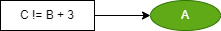|
|OP13|Subtraction|- |#(C > B - 3)| C != B minus 3. |  |
|OP14|Multiplication | * | @(C =  B * 3)  | B multiplied by 3 to assign to C| |
|OP15|Division|/ | #(C ==  B / 3) | C == B divided by 3. | 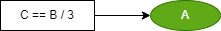|

 

### 2.4 Logical operation(논리연산)

|Id| Item | Unit | Example| Desc |  GUI |
|:---:|:----|:--:|:---:|:----|:---|
|OP16| And | & | #(A&B) > C | C be caused by A end  & B end | |
|OP17| Or | \| | #(A\|B) > C | C be caused by A end or B end | |
|OP18| Not | ! | #(!A) > B | B be caused by not end A | |
|OP19| XOR | #xor( , ) | #xor(B, C) > A | A is exclusive or (B end, C end) ||
|OP20| NXOR | #nxor( , ) | #nxor(B, C) > A | A is NXOR (B end, C end) ||
|OP21| NAND | #nand( , ) | #nand(B, C) > A | A is NAND (B end, C end) ||
|OP22| NOR | #nor( , ) | #nor(B, C) > A | A is NOR (B end, C end) ||
 

### 2.5 Data operation(데이터 처리)

|Id| Item | Unit | Example| Desc |  GUI |
|:---:|:----|:--:|:---:|:----|:---|
|OP23|Copy | `=` | `A > @(C = B)`  | Copy B to C is caused by action A|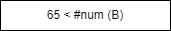|
|OP24|Initialize|`=` |`#(A < 65) > @(A = 65)`| Initialize A. |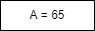|

 

### 2.6 Time operation(시간연산)

|Id| Item | Unit | Example| Desc |  GUI |
|:---:|:----|:--:|:---:|:----|:---|
|OP25|On Delay(Start Edge Only) | @ms, @s| A > @ms (500) > B  | B be caused by A finish 500 msec delay    ||
|OP26|Off Delay |None || Use On Delay    ||

 

### 2.7 Data conversion(값 형식 변환)

|Id| Item | Unit | Example| Desc |  GUI |
|:---:|:----|:--:|:---:|:----|:---|
|OP27| Numeric  | #num ()   |` #(65 < #num (B)) ` | if converts B to Numeric,  GT(greater than) 65  ||
|OP28| String  |#str ()   | ` @(C = #str (B)) `  | C converts B to String.  | |
|OP29| BCD  | #bcd ()   |` @(C = #bcd (B)) `   | C converts B to BCD.  ||
|OP30| BIN  | #bin ()  |` @(C = #bin (B)) ` | C converts B to BIN.  ||

 

## 3. Application

### 3.1 Calculation operation

|Id| Item | Unit | Example| Desc |  GUI |
|:---:|:----|:--:|:---:|:----|:---|
|FUN1|Abs | #abs  | #(65 == #abs (A))  | Calculate the absolute value of A. ||
|FUN2|Sin| #sin|#(65 == #sin (A))| Calculate the Sin of A. ||
|FUN3|Round | #round | #(65 == #round (A)) | Calculate the rounding of A.  || 

## 4. Interface  

### 4.1 Priority operation

|Id| Item | Unit | Example| Desc | GUI |
|:---:|:----|:--:|:---:|:----|:---|
|IF1|Start Priority | @sf | A > @sf (B) <\|C  | The B start value overrides the B reset value. | 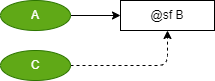|
|IF2|Last Priority  |  @lf  | A > @lf (B) <\|C | During startup/reset, last occurrence takes precedence | |
 

### 4.2  Sustain operation

|Id| Item | Unit | Example| Desc | GUI |
|:---:|:----|:--:|:---:|:----|:---|
|IF3|Start Sustain | @pushs ( ) | A > @pushs (B)  | B start signal Sustain until B is Finish |  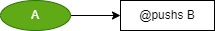|
|IF4|Reset Sustain | @pushr ( ) | A > @pushr (B)  | B reset signal Sustain until B is Ready |  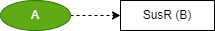|
|IF5|SR Sustain | @pushsr | A > @pushsr (B)  <\| C | B start signal Sustain until B is Finish and 
  B reset signal Sustain until B is Ready  |  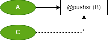|

 

### 4.3 Single  operation

|Id| Item | Unit | Example| Desc | GUI |
|:---:|:----|:--:|:---:|:----|:---|
|IF6|Start Single | @onlys  ( )| A > @onlys (B)  | The B reset value is B start not |  |
|IF7|Reset Single | @onlyr ( )| A \|> @onlyr (B)  | The B start value is B reset not |  |
|IF8|Self Start | @selfs ( )| @selfs (B) > A   | The B start value is always on |  |
|IF9|Self Reset | @selfr ( )| A > @selfr (B)    | The B reset value is B end Value |  |
 

## 5. system

### 5.1  Constain

|Id| Item | Unit | Example| Desc |  GUI |
|:---:|:----|:--:|:---:|:----|:---|
|SYS1|Numeric |   | #(C == 3) > A  | A be caused by B Equal to 3 | |
|SYS2|String |' ' | #('C'== B) > A| A be caused by B Equal to 'C'| |

### 5.2  system Bit

|Id| Item | Unit | Example| Desc |  GUI |
|:---:|:----|:--:|:---:|:----|:---|
|SYS3|Always On | _on | _on > A  | A be caused by Always On | |
|SYS4|Always Off |_off | _off > A| A be caused by Always Off | |
|SYS5|Running Flag |_run | _run > A| A be caused by system Run | |
|SYS6|Stop Flag |_stop | _stop > A| A be caused by system Stop| |
|SYS7|Running Rising |_runr | _runr > A | A be caused by system Run Rising| |
|SYS8|Running Falling |_runf | _runf > A | A be caused by system Run Rising | |

### 5.3  system timer

|Id| Item | Unit | Example| Desc | GUI |
|:---:|:----|:--:|:---:|:----|:---|
|SYS9|Toggle #s | _toggles () or _togglems() | _togglems (50) > A  | On/Off occurs at periodic intervals of 50msec. |  |
