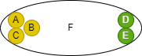

# DS text language table
### 1. Causal(원인결과 정의)
|Id| Item | Unit |Example|   Desc |  GUI | 
|:---:|:----|:--:|:---:|:----|:---|
|SEQ1|Start Causal|`>`| `A > B > C` |Action B would be executed by causal action A, action C would be executed by causal action B  
`행위 B는 행위 A에 의해 실행되며, 행위 C는 행위 B에 의해 실행됨`| |
|SEQ2|Reset Causal| `\|>` | `A > B <\| C` |Action B would be executed by causal action A, and the action B would be initialized(reset) by causal action C 
`행위 B는 행위 A에 의해 실행되며, 행위 C에 의해 리셋됨`| |
|SEQ3|And Causal|`,`|`A,B,C > D,E` | Action D would be executed by united causal action A, B and C and also action E would be executed by same causal actions as D 
`행위 D, E는 행위 A, B, C에 의해 실행됨`|  |
|SEQ4|Or Causal|`\`| `A, B \ C > D` | Action D would be executed by causal action A and B
 Or action D would be executed by causal action C 
`행위 D는 행위 A, B에 의해 실행되거나, 행위 C에 의해 실행됨`| |
|SEQ5|Causal Split|`;`| `A,B > D;`
`C > D;` | Action D would be executed by causal action A and B
 Or action D would be executed by causal action C 
`행위 D는 행위 A, B에 의해 실행되거나, 행위 C에 의해 실행됨`| |

 

### 2. Call(행위 부르기)

|Id| Item | Unit | Example | Desc |   GUI | 
|:---:|:----|:--:|:----|:---|:---|
|SEQ6|Call | `~` |`C = {A ~ B}`
 `C = {_ ~ B}` 
 empty key is `_` | Upper - Action C calls the action A to execute the DA셋(A ~ B), and indicates the state of action B
Lower - Action C just indicates the state of action B without executing
`위 - 행위 C는 행위 A를 실행시키며, 행위 B의 상태를 나타냄`
`아래 - 행위 C는 행위 B의 상태만을 나타냄`| |
|SEQ7|And Call|`,`| `F = {A,B,C ~ D,E}`|Action F calls the action A, B and C to execute the DAG(A,B,C ~ D,E), and indicates the state of action D and E
`행위 F는 행위 A, B, C를 실행시키며, 행위 D, E의 상태를 나타냄`| 
|SEQ8|Reset Call|`~ ~`| `H = {A,B,C ~ D,E ~ F,G}`|Action H calls the action A, B and C to execute the DAG(A,B,C ~ D,E), or calls the action F, G to reset the state of action D and E
And indicates the state of action D and E
`행위 F는 진행을 위해 행위 A, B, C를 실행시키거나 복귀를 위해 행위 F, G를 실행시킬 수 있고, 이에 따라 변화되는 행위 D, E의 상태를 나타냄`| |

 

### 3. Parent(행위 부모 할당)

|Id| Item | Unit | Example | Desc |   GUI | 
|:---:|:----|:--:|:----|:---|:---|
|SEQ9|system Parent | `[sys]=` |  [sys]D = { A > B <\| C } | System D parallelly processes the actions included in the causality DAG
`시스템 D는 인과 그래프(DAG)에 포함된 행위들을 '병렬'적으로 처리함`  | |
|SEQ10|Segement Parent| `=` |  D = { A > B <\| C } | Action D sequentially processes the actions included in the causality DAG
`행위 D는 인과 그래프(DAG)에 포함된 행위들을 '순차'적으로 처리함` | |
 

### 4. Causal Extension (행위 확장)

|Id| Item | Unit | Example | Desc |   GUI | 
|:---:|:----|:--:|:----|:---|:---|
|SEQ11| mutual interlock | <\|\|> |  A <\|\|> B 
is equal to A <\| B ; A \|> B| Action A and Action B are linked in a mutually exclusive interlock
`행위 A와 행위 B는 상호 배타적인 인터락으로 연결되어 있음`  | |
|SEQ12| resetStart | \|>> |  A \|>> B 
is equal to A > B ; A \|> B| Action B would be executed by the end of causal action A
And also B would be initialized(reset) by executing causal action A
`행위 B는 행위A에 의해 실행되며, 행위 A의 실행중에 리셋됨` | |

