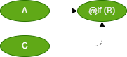

# DS text language table
## 1. Sequence
### 1.1 Causal(원인결과 정의)
|Id| Item | Unit |Example|   Desc |  GUI | 
|:---:|:----|:--:|:---:|:----|:---|
|SEQ1|Start Causal|`>`| `A > B > C` |Action B is caused by action A, action C is caused by action B  
`B행위는 A행위으로, C행위는 B행위으로 인해 수행`| |
|SEQ2|Reset Causal| \|> | A > B <\| C|Action B is caused by action A, B is initialized(reset) to action A 
`B행위는 A행위으로 인해 발생 하며 B행위는 C행위으로 복귀`| |
|SEQ3|And Causal|`,`|`A,B,C > D,E` | D, E be caused by action (A and B and C) 
`D, E행위는 A행위, B행위, C행위에 의해 수행`|  |
|SEQ4|Or Causal|\|\|| A, B \|\| C > D | D be caused by (A and B) or C 
`D행위는 A행위, B행위에 의해 수행하거나, C 행위에 의해 수행`| |
|SEQ5|List Causal|`;`| `A,B > D;C > D` | D be caused by A and B
 D be caused by C 
`D행위는 A행위, B행위에 의해 수행하거나, C 행위에 의해 수행`| |

 

### 1.2 Call(행위 부르기)

|Id| Item | Unit | Example | Desc |   GUI | 
|:---:|:----|:--:|:----|:---|:---|
|SEQ6|Call | `~` |`C = {A ~ B}` | Action C indicates the end state of B by executing A
`C행위는 A를 수행시킴으로 B의 종료상태를 관찰`| |
|SEQ7|And Call|`,`| `F = {A,B,C ~ D,E}`|Action F indicates the end state of D, E by executing A, B, C
`F행위는 A, B, C를 수행시킴으로 D, E의 종료상태를 관찰`| |

 

### 1.3 Parent(행위 부모 할당)

|Id| Item | Unit | Example | Desc |   GUI | 
|:---:|:----|:--:|:----|:---|:---|
|SEQ8|System Parent | `[Sys]=` |  [Sys]D = { A > B <\| C } | System D processes that causality concurrently 
` 시스템 D는 해당 인과를 동시적으로 처리`  | |
|SEQ9|Segement Parent| `=` |  D = { A > B <\| C } | Action D processes its causal relationship sequentially 
` 행위 D는 해당 인과를 순차적으로 처리` | |
 

### 1.4 Causal Extension (행위 확장)

|Id| Item | Unit | Example | Desc |   GUI | 
|:---:|:----|:--:|:----|:---|:---|
|SEQ10| mutual interlock | <\|\|> |  `A <||> B` 
is equal to `A <| B ; A |> B`| Action A and Action B are mutually interlocked 
` A 행위와 B 행위는 상호 인터락`  | |
|SEQ11| resetStart | \|>> |  `A |>> B` 
is equal to `A > B ; A |> B`| Action B is caused by action A, B is initialized(reset) to action A 
`B행위는 A행위으로 인해 수행 하며 B행위는 A행위으로 복귀` | |

 

## 2. Data

### 2.1 Value operation (행위 값)

|Id| Item | Unit | Example| Desc |  GUI |
|:---:|:----|:--:|:---:|:----|:---|
|OP1|End  Value | ( ) | `(Seg), A > B`  | B be caused by action A when the Seg End Port (sensor) value is 'True'. 
` 행위 B는 Seg의 End Port(sensor) 값이 'True' 일 경우에서 행위 A가 수헹되었을때 수행`    ||
|OP2|End Set Value | @SET( )| `@SET(Seg) > B` | B be caused by Seg End Port latch value(auto reset by @G(B)) 
` 행위 B는 Seg의 End Port(sensor) 값이 'True' 면 값 유지(B행위 Going 시에 자동 값 리셋)`      ||
|OP3|End  Value | @LATCH( , )| `@LATCH(SegA, @G(SegB)) > B` | B be caused by Seg End Port latch value(auto reset by @G(B)) 
` 행위 B는 Seg의 End Port(sensor) 값이 'True' 면 값 유지(설정 값에 의한 리셋)`  ||
|OP4|Going Status|@G( ) |`@G(Seg) > B`| B be caused by Seg Going Value
` 행위 B는 Seg가 Going 경우 인해 수행`      ||
|OP5|Homing Status|@H( ) |`@H(Seg) > B` | B be caused by Seg Homing Value 
` 행위 B는 Seg가 Homing 경우 인해 수행`     ||

 

##GUI 작업중 2.2 ~
### 2.2 Comparision operation (비교연산) - system level only -

|Id| Item | Unit | Example| Desc |  GUI |
|:---:|:----|:--:|:---:|:----|:---|
|OP6|Equals|[ == ]|[B == 3] > A| A be caused by if B EQ(equal) 3. |    |
|OP7|Not equals |[ != ]|[B != 3] > A| A be caused by if B NE(not equal) 3. |    |
|OP8|Greater than |[ > ]|[B > 3] > A| A be caused by if B GT(greater than) 3. |    |
|OP9|Less than|[ < ]|[B < 3] > A| A be caused by if B LT(less than) 3. |    |
|OP10|Greater Equals than |[ >= ]|[B >= 3] > A| A be caused by if B GE(greater than or equal ) 3.|    |
|OP11|Less Equals than|[ <= ]|[B <= 3] > A| A be caused by if B LE(less than or equal ) 3. |    |

 

### 2.3 Arithmetic operation(산술연산)

|Id| Item | Unit | Example| Desc |  GUI |
|:---:|:----|:--:|:---:|:----|:---|
|OP12|Addition | + | B + 3 | B plus 3. ||
|OP13|Subtraction|- |B - 3| B minus 3. | |
|OP14|Multiplication | * | B * 3  | B multiplied by 3. ||
|OP15|Division|/ |B / 3| B divided by 3. | |

 

### 2.4 Logical operation(논리연산)

|Id| Item | Unit | Example| Desc |  GUI |
|:---:|:----|:--:|:---:|:----|:---|
|OP16| And | & | A&B > C | C be caused by A end  & B end |
|OP17| Or | \| | A\|B > C | C be caused by A end or B end | 
|OP18| Not | ! | !A > B | B be caused by not end A | |
|OP19| XOR | @XOR( , ) | @XOR(B, C) > A | A is exclusive or (B end, C end) |
|OP20| NXOR | @NXOR( , ) | @NXOR(B, C) > A | A is NXOR (B end, C end) |
|OP21| NAND | @NAND( , ) | @NAND(B, C) > A | A is NAND (B end, C end) |
|OP22| NOR | @NOR( , ) | @NOR(B, C) > A | A is NOR (B end, C end) |
 

### 2.5 Data operation(데이터 처리)

|Id| Item | Unit | Example| Desc |  GUI |
|:---:|:----|:--:|:---:|:----|:---|
|OP23|Copy | `<-` | `C <- B`  | Copy B to C. ||
|OP24|Initialize|`=` |`A = 65`| Initialize A. ||

 

### 2.6 Time operation(시간연산)

|Id| Item | Unit | Example| Desc |  GUI |
|:---:|:----|:--:|:---:|:----|:---|
|OP25|On Delay(Start Edge Only) | @ms, @s| A > @500ms > B  | B be caused by A finish 500 msec delay    ||
|OP26|Off Delay |None || Use On Delay    ||

 

### 2.7 Data conversion(값 형식 변환)

|Id| Item | Unit | Example| Desc |  GUI |
|:---:|:----|:--:|:---:|:----|:---|
|OP27| Numeric  | @NUM( )  |` C <- @NUM(B) ` | C converts B to Numeric.  | |
|OP28| String  |@STR( )  | `C <- @STR(B) ` | C converts B to String.  |  |
|OP29| BCD  | @BCD( )  | `C <- @BCD(B)`  | C converts B to BCD.  |
|OP30| BIN  | @BIN( )  |` C <- @BIN(B)`  | C converts B to BIN.  |

 

## 3. Application

### 3.1 Calculation operation

|Id| Item | Unit | Example| Desc |  GUI |
|:---:|:----|:--:|:---:|:----|:---|
|FUN1|Abs | @ABS( ) | @ABS (A)  | Calculate the absolute value of A. |
|FUN2|Sin| @SIN( )|@SIN (A)| Calculate the Sin of A. | 
|FUN3|Round | @ROUND( )| @ROUND (A) | Calculate the rounding of A.  | 

## 4. Interface  

### 4.1 Priority operation

|Id| Item | Unit | Example| Desc | GUI |
|:---:|:----|:--:|:---:|:----|:---|
|IF1|Start Priority | @SF( )  | A > @SF(B) <\|C  | The B start value overrides the B reset value. | |
|IF2|Last Priority  |  @LF( )  | A > @LF(B) <\|C | During startup/reset, last occurrence takes precedence | |
 

### 4.2  Sustain operation

|Id| Item | Unit | Example| Desc | GUI |
|:---:|:----|:--:|:---:|:----|:---|
|IF3|Start Sustain | @SusS ( ) | A > @SusS (B)  | B start signal Sustain until B is Finish |  |
|IF4|Reset Sustain | @SusR ( ) | A > @SusR (B)  | B reset signal Sustain until B is Ready |  |
|IF5|SR Sustain | @SusSR ( ) | A > @SusSR (B)  <\| C | B start signal Sustain until B is Finish and 
  B reset signal Sustain until B is Ready  |  |

 

### 4.3 Single  operation

|Id| Item | Unit | Example| Desc | GUI |
|:---:|:----|:--:|:---:|:----|:---|
|IF6|Start Single | @OnlyS ( ) | A > @OnlyS (B)  | The B reset value is B start not |  |
|IF7|Reset Single | @OnlyR ( ) | A > @OnlyR (B)  | The B start value is B reset not |  |
|IF8|Self Reset | @SelfR ( ) | A > @SelfR (B)    | The B reset value is B end Value |  |

 

## 5. System

### 5.1  Constain

|Id| Item | Unit | Example| Desc |  GUI |
|:---:|:----|:--:|:---:|:----|:---|
|SYS1|Numeric |   | 3 + B > A  | A be caused by B add 56 | #3 = ~ Numeric.Bit0, Numeric.Bit1 |
|SYS2|String |' ' | ['C' = B] > A| A be caused by B Equal to 'A' | $A = ~ String.Bit0, String.Bit6 |

### 5.2  System Bit

|Id| Item | Unit | Example| Desc |  GUI |
|:---:|:----|:--:|:---:|:----|:---|
|SYS3|Always On | _On | _On > A  | A be caused by Always On | Numeric.Bit0 > On |
|SYS4|Always Off |_Off | _Off > A| A be caused by Always Off | (! Numeric.Bit0) > Off |
|SYS5|Running Flag |_Run | _Run > A| A be caused by System Run | (SystemRoot.S) > (OnlyS Run) |
|SYS6|Stop Flag |_Run | _Stop > A| A be caused by System Stop | (SystemRoot.R) > (OnlyS Stop) | 
|SYS7|Running Rising |_RisingRun | _RisingRun > A | A be caused by System Run Rising | (SystemRoot.S) > (OnlyS Run) | 

### 5.3  System timer

|Id| Item | Unit | Example| Desc | GUI |
|:---:|:----|:--:|:---:|:----|:---|
|SYS8|toggle #s | _T | _T50ms > A  | On/Off occurs at periodic intervals of 50msec. | T1 <\|> T2; T1 (50ms)> T2 ; T2 (50ms)> T1; (T2.E) > A |