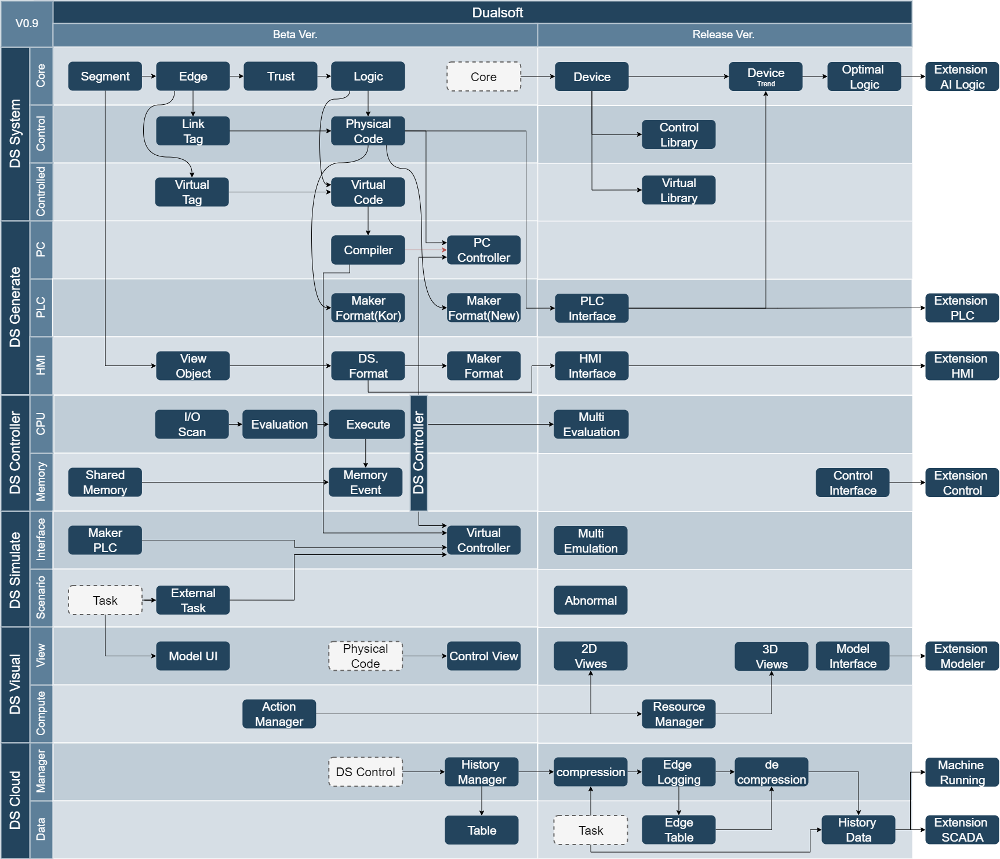

# Todo list

## Engine
- cpu/plc, hmi configuration, 다중 CPU 처리
- runtime
    * origin check
    - [x] 인과 처리 (기본 relay)
    * logging
    * run 중 edit
- simulator
- 엘리베이터 키트

## Compiler
- [x] language parser
- macro expansion
- hmi generator
- ~~PLC cross compiler~~

## I/O server
- PAIX, PLC, OPC, ... wrapper

## HMI, 모니터
- Web based
- ~~unity3D~~

## Editor / IDE : local and/or web based
- GUI base
- text based
- vscode extension
    - [x] syntax highlighting/checking
    - [ ] code completion, snippet..
    - [x] readonly view

## REST server
- hmi, monitor 등이 local 망에서 접속 시, cloud 에 접속한 것과 동일 API 제공해야 함
- engine 에서 발생하는 logging data 를 cloud 에 전송

## Cloud

