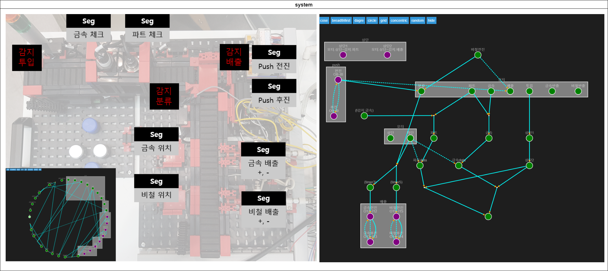

:smile: Welcome to the DS world  :smile:
# Example


 
 
  - action list 
    1. 하단1
    2. 하단2
    3. 금속배출
    4. 비철배출
    5. push_work
    6. 작업


```ex
[sys] part_sorter = {
    [task] 감지 = {투입;금속;파트;배출;분류;금속반출;비철반출;}
    [task] 모터 = {상단;하단;}
    [task] 배출 = {
        금속전진 = {O12 ~ I12}
        금속후진 = {O13 ~ I13}
        비철전진 = {O15 ~ I15}
        비철후진 = {O14 ~ I14}
    }

    [task]push = {
        전진 = {O8 ~ I8}
        후진 = {O9 ~ I9}
    }

    [task] 상단 = {
        상단1 = {모터.상단 ~ 감지.파트}
        상단2 = {모터.상단 ~ 감지.배출}
    }

    [flow] 하단1 = {
        모터.하단, 감지.분류 > (timer3) > 배출.금속전진 > 배출.금속후진;
    }
    [flow] 하단2 = {
        모터.하단,감지.분류 > (timer5) > 배출.비철전진 > 배출.비철후진;
    }

    [flow] 금속배출 = {
        배출.금속전진 <||> 배출.금속후진;
    }
    [flow] 비철배출 = {
        배출.비철전진 <||> 배출.비철후진; 감지.배출 <| 비철전진 > 감지.분류;
    }

    [flow] push_work = {
       감지.배출 <| push.전진 > 감지.분류;
       push.전진 <||> push.후진;

    }

    [flow] 작업 = {
        감지.투입 > 상단1 > 상단2;
        감지.금속, 감지.파트 > 금속 > 금속data;
        상단2, 금속data > @slfr(하단.하단1);
        감지.파트,(!감지.금속) > 파트 > 파트data;
        상단2, 파트data > @slfr(하단.하단2);

        금속data <| 모터.하단 |>  파트data;
    }
    
}
```
